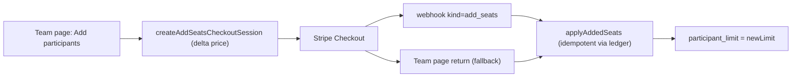

# Hacksathon.com — Technical Architecture

> As-built reference, June 2026. This reflects what currently ships in
> `hacksathon-app/`, not the original aspirational design. Where a
> surface is planned but not yet wired, it is called out explicitly.

## Stack

| Layer | Choice |
| --- | --- |
| Framework | Next.js 16.2.2 (App Router, React 19.2.4 Server Components) |
| Styling | Tailwind CSS v4 + shadcn/ui (Radix primitives via `radix-ui`) |
| Data / Auth | Supabase (Postgres + Auth) via `@supabase/ssr` + `@supabase/supabase-js` |
| AI | Vercel AI SDK v6 (`ai`) with `@ai-sdk/anthropic` (Claude) |
| Email | Resend (`resend`) + React Email (`@react-email/*`) |
| Payments | Stripe Checkout (`stripe`) - purchase-first provisioning + add-seats |
| Analytics | PostHog (`posthog-js` + server capture via `lib/analytics`) |
| Toasts | `sonner` |
| Export | `jszip` (document/markdown export) |
| Icons | `lucide-react` (closed allowlist — see design system) |
| Hosting | Vercel (production: `hacksathon.com`) |

**Billing is live.** Stripe Checkout drives a purchase-first flow:
checkout Server Actions (`src/app/checkout/actions.ts`), an
`api/stripe/webhook` fulfillment route, and the `lib/stripe` +
`lib/billing` layer (pricing, provisioning, seat accounting). See the
"Billing & Seats" section below. **PostHog is live** for web + product
analytics (`lib/analytics`, `instrumentation-client.ts`).

**Not yet wired:** there is **no Supabase Realtime** usage in the
codebase today; it appeared in the original design but is not built.
Live counts on admin surfaces are plain server reads.

## Next.js App Router Structure

Member-facing surfaces are **slug-based** (`/[companyslug]/...`). The
older `(platform)/events/[id]/...` routes still exist and are being
phased out in favor of the slug routes.

```
src/app/
├── (marketing)/                     # Public marketing (no auth)
│   ├── layout.tsx
│   ├── page.tsx                     # Homepage
│   ├── pricing/page.tsx
│   ├── case-study/page.tsx
│   ├── showcase/page.tsx
│   └── waitlist/page.tsx
│
├── (auth)/                          # Auth pages (centered card layout)
│   ├── layout.tsx
│   ├── login/page.tsx
│   ├── signup/page.tsx
│   ├── forgot-password/page.tsx
│   └── reset-password/page.tsx
│
├── (platform)/                      # Authenticated platform shell
│   ├── layout.tsx
│   ├── dashboard/page.tsx           # Role-based redirect / home
│   ├── settings/page.tsx            # Profile + account security
│   ├── plan/page.tsx
│   ├── idealab/page.tsx
│   └── events/                      # LEGACY (being phased out)
│       ├── page.tsx
│       ├── new/page.tsx
│       └── [id]/
│           ├── page.tsx
│           ├── admin/page.tsx
│           ├── blocks/[blockKey]/page.tsx
│           └── idealab/{page,new,[ideaId]}/page.tsx
│
├── [companyslug]/                   # Slug-based member experience
│   ├── layout.tsx                   # Resolves slug context + viewer
│   ├── page.tsx                     # Event home (participant)
│   ├── blocks/page.tsx              # Block timeline
│   ├── blocks/[blockKey]/page.tsx   # Single block workspace
│   ├── idea/{page,new}/page.tsx
│   ├── idealab/{page,[ideaId]}/page.tsx
│   ├── gallery/{page,[ideaId]}/page.tsx
│   ├── reflections/page.tsx
│   ├── awards/page.tsx
│   └── admin/                       # Admin-only (gated in layout.tsx)
│       ├── layout.tsx               # is_event_admin gate + sub-nav
│       ├── page.tsx                 # 00 Hacky Helper (overview)
│       ├── identity/page.tsx        # 01
│       ├── integrations/page.tsx    # 02
│       ├── schedule/page.tsx        # 03
│       ├── team/page.tsx            # 04
│       ├── awards/page.tsx          # 05
│       ├── reflections/page.tsx     # 06
│       ├── org/page.tsx             # legacy redirect target
│       └── event/page.tsx           # legacy redirect target
│
├── accept-invite/[token]/page.tsx   # Public set-password landing (email invite)
├── join/[token]/page.tsx            # Public join-link landing (request to join)
│
├── api/                             # See route table below
├── layout.tsx                       # Root layout (fonts, metadata)
└── globals.css                      # Tailwind v4 + design tokens
```

> **Platform-owner console (Murtopolis):** a separate owner-only admin at
> `(platform)/murtopolis/*` (gated by the `platform_admins` table /
> `is_platform_admin()` RPC) tracks cross-tenant customers, users,
> waitlist, and revenue. Built but not yet committed/deployed — see
> `Claude Planning Docs/murtopolis-owner-dashboard.md` for the full
> implementation handoff.

> **Social share images (OG / Twitter):** generated at request time with
> `next/og` via the file conventions `src/app/opengraph-image.tsx` +
> `twitter-image.tsx` (static marketing default) and
> `src/app/[companyslug]/opengraph-image.tsx` + `twitter-image.tsx`
> (dynamic per-event override). Both call the shared renderer in
> `src/lib/og/share-image.tsx` and load the bundled EB Garamond woff
> fonts from `src/lib/og/`. Full design spec, the size/copy knobs, and
> the font-loading gotcha live in the "Social Share Images (OG / Twitter)"
> section of `Claude Planning Docs/hacksathon-design-system.md`.

### API Routes

```
src/app/api/
├── auth/signout/route.ts                       # POST (303 redirect)
├── profile/route.ts                            # PATCH name / avatar_url
├── settings/password/route.ts                  # POST password change (+ sign out others)
├── waitlist/route.ts                           # POST marketing waitlist
├── support/route.ts                            # POST (public) support / custom-quote message
├── stripe/webhook/route.ts                     # POST Stripe fulfillment (provision / add-seats)
├── organizations/[id]/route.ts                 # PATCH org (name, etc.)
├── events/[id]/route.ts                        # PATCH event (incl. date windows)
├── events/[id]/logo/route.ts                   # POST / DELETE logo
├── events/[id]/join-link/route.ts              # POST / DELETE shareable join token
├── events/[id]/invites/route.ts                # GET / POST email invites (Resend)
├── events/[id]/invites/[inviteId]/route.ts     # DELETE invite
├── events/[id]/invites/[inviteId]/resend/route.ts  # POST resend
├── events/[id]/members/[memberId]/route.ts     # DELETE member / PATCH is_participating
├── events/[id]/members/[memberId]/approve/route.ts # PATCH approve pending member
├── events/[id]/members/[memberId]/role/route.ts    # PATCH role (participant/admin)
├── events/[id]/admin/notify/route.ts           # POST notify members (block/voting/reflections/idealab)
├── events/[id]/admin/voting/{open,close,reveal,publish}/route.ts  # POST voting lifecycle
├── events/[id]/admin/awards/[awardId]/route.ts # PATCH award (ceremony review)
├── events/[id]/admin/reflections/status/route.ts           # POST open/close reflections
├── events/[id]/admin/reflections/summary/route.ts          # POST generate AI recap
├── events/[id]/admin/reflections/summary/approve/route.ts  # POST approve recap
├── accept-invite/route.ts                      # POST (public) accept email invite
├── join/[token]/route.ts                       # POST (public) request to join
├── signup-via-join/route.ts                    # POST (public) branded join signup
├── blocks/[id]/route.ts                        # PATCH block schedule
├── blocks/complete/route.ts                    # POST mark block complete
├── award-categories/route.ts                   # POST category
├── award-categories/[id]/route.ts              # PATCH / DELETE category
├── awards/vote/route.ts                         # POST ballot
├── reflection-questions/route.ts               # POST question
├── reflection-questions/[id]/route.ts          # PATCH / DELETE question
├── reflections/route.ts                         # POST reflection (date-window gated)
├── ideas/route.ts                               # POST idea
├── ideas/[id]/route.ts                          # PATCH / DELETE idea
└── planning/{brief,session,step,starter-prompt}/route.ts  # ZERO.Prmptr / Blueprint flow
```

> **Checkout is a Server Action, not an API route.** Initial purchase and
> add-seats sessions are created in `src/app/checkout/actions.ts`
> (`createCheckoutSession`, `createAddSeatsCheckoutSession`); fulfillment
> lands on `api/stripe/webhook` with a `checkout/success` fallback. See
> "Billing & Seats."

All admin-only routes call `requireEventAdmin(eventId)` from
`src/lib/server/event-admin-guard.ts`, which authenticates the user and
calls the `is_event_admin` SECURITY DEFINER RPC (avoids RLS recursion
through `events` / `organization_members`).

## Components

```
src/components/
├── ui/                              # shadcn/ui primitives
│   ├── button, card, dialog, dropdown-menu, input, input-group,
│   ├── select, switch, tabs, table, textarea, label, badge,
│   ├── accordion, popover, sheet, tooltip, separator, command,
│   └── avatar, user-avatar, sonner
│
├── admin/
│   ├── admin-section.tsx            # <AdminSection> + <AdminField> editorial frame
│   ├── voting-controls.tsx
│   ├── reflection-summary-panel.tsx
│   ├── fields/datetime-15-field.tsx # Date + 15-min <select> picker
│   └── sections/
│       ├── hacky-helper.tsx         # The always-on guided walkthrough
│       ├── org-basics.tsx
│       ├── event-title.tsx
│       ├── event-welcome.tsx
│       ├── event-logo.tsx
│       ├── event-vanity-url.tsx
│       ├── event-team-chat.tsx
│       ├── event-build-tool.tsx
│       ├── event-public-showcase.tsx
│       ├── event-schedule.tsx
│       ├── participants-panel.tsx   # Roster + invites + JoinLinkBlock + seat meter / Add participants / participation toggle
│       ├── award-categories-editor.tsx
│       ├── voting-window.tsx
│       ├── reflection-questions-editor.tsx
│       └── reflection-window.tsx
│
├── event-nav/
│   ├── participant-nav.tsx
│   └── admin-subnav.tsx             # 00 Hacky Helper → 06 Reflections
│
├── event-home/blocks-timeline.tsx
│
├── blocks/                          # Participant block workspaces
│   ├── build-session, zero-screen, shark-tank-screen,
│   ├── hacky-awards-screen, reflections-screen, reflection-form,
│   ├── award-ballot, showcase-prep, lock-my-idea-button
│
├── planning/                        # ZERO.Prmptr / Blueprint conversation
│   ├── planning-flow, ai-message, user-input, step-indicator,
│   ├── starter-prompt, project-brief-card, post-prd-input
│
├── idealab/
│   ├── idea-card, idea-detail, idea-details-modal, idea-form,
│   ├── idea-progress-timeline, screenshot-uploader, char-counter,
│   └── blueprint-flow-dialog
│
├── showcase/
│   ├── showcase-hero, idea-gallery, winners-grid, showcase-recap,
│   └── showcase-teaser, showcase-footer
│
├── join/
│   ├── event-identity.tsx
│   └── request-to-join-button.tsx
│
├── settings/
│   ├── profile-section.tsx
│   └── account-security-section.tsx
│
├── auth/
│   ├── auth-form.tsx
│   └── accept-invite-form.tsx
│
├── site/
│   ├── site-header.tsx              # Marketing header (auth-aware CTAs)
│   ├── site-footer.tsx
│   ├── prompt-caret.tsx             # `>` brand mark prepended to the wordmark
│   ├── mobile-nav.tsx               # Hamburger -> Sheet (marketing, <= md)
│   └── user-menu.tsx
│
└── waitlist/waitlist-form.tsx
```

## Library Layer

```
src/lib/
├── supabase/
│   ├── client.ts                    # Browser client
│   ├── server.ts                    # Cookie-bound server client
│   ├── admin.ts                     # Service-role client
│   └── middleware.ts                # updateSession() — session refresh + last-active touch
│
├── ai/
│   ├── model.ts                     # Anthropic model via AI SDK
│   └── reflection-summary-prompt.ts
│
├── billing/                         # Stripe pricing + provisioning + seats
│   ├── pricing.ts                   # priceForSeats / priceForSeatIncrease
│   ├── provision.ts                 # provisionPaidEvent + applyAddedSeats (idempotent)
│   └── seats.ts                     # getEventSeatUsage() (single source of truth)
│
├── stripe/client.ts                 # getStripe() singleton
│
├── analytics/                       # PostHog
│   ├── server.ts                    # captureServer() server-side events
│   └── events.ts                    # AnalyticsEvent enum (shared event names)
│
├── helper/                          # Hacky Helper engine
│   ├── phase.ts                     # stops/steps, kinds, phase, nextStep
│   └── loader.ts                    # loadHelperContext()
│
├── events/settings.ts               # stampSetting() milestone tracking
│
├── voting/
│   ├── transitions.ts               # openVoting / revealAwards (shared)
│   └── auto-transition.ts           # lazy date-window auto-flip
│
├── og/                              # Generated social share images (next/og)
│   ├── share-image.tsx              # Shared grayscale renderer + resolveLogo()
│   ├── fonts.ts                     # loadOgFonts() (reads bundled woff via fs)
│   └── fonts/EBGaramond-{Regular,Italic}.woff
├── join/{tokens.ts,preview.ts}      # Join-link token gen + public preview
├── invites/tokens.ts                # Email invite token gen + expiry
├── reflections/questions.ts
├── awards/categories.ts
├── blocks/status.ts
├── datetime/local-input.ts          # datetime-local <-> ISO helpers
├── planning/{types,steps,ensure-session,context,prompts,index}.ts
├── idealab/{url,types,format-relative-date}.ts
├── routing/{slug-context,reserved-slugs,site-url}.ts   # site-url.ts -> absolute base URL for callbacks
├── auth/checkout-intent.ts          # stash/restore checkout intent across login
├── server/event-admin-guard.ts      # requireEventAdmin()
├── server/platform-admin-guard.ts   # requirePlatformAdmin() (Murtopolis console)
├── server/rate-limit.ts             # in-process per-IP throttle for public endpoints
├── build-tool/labels.ts
├── user/display-name.ts
├── email/resend.ts                  # sendEmail() wrapper (degrades when key unset)
├── email/send-purchase-welcome.ts   # buyer welcome + internal purchase notification
├── email/send-participant-welcome.ts
├── email/notify-members.ts          # bulk member notifications
└── utils.ts
```

## Middleware

`src/middleware.ts` delegates to `updateSession()` in
`src/lib/supabase/middleware.ts`, which:

1. Refreshes the Supabase session on every matched request.
2. Fires the throttled `touch_my_activity` RPC (fire-and-forget) to keep
   `profiles.last_active_at` current for the roster "Last seen" column.
3. Gates a private-prefix allowlist (`/dashboard`, `/events`, `/idealab`,
   `/plan`, `/settings`) — unauthenticated hits redirect to `/login?redirect=...`.
   Everything else (marketing, auth, vanity slug routes, invite/join
   landings, public showcases) is treated as public and the page handles
   auth-aware rendering.
4. Redirects authenticated users away from `/login` and `/signup` to
   `/dashboard`.

Admin authorization is **not** done in middleware — it lives in
`[companyslug]/admin/layout.tsx` (non-admins 404) and in every admin API
route via `requireEventAdmin`.

## Security

Hacksathon.com collects personal data, so the security model is
documented separately and in full in [SECURITY.md](SECURITY.md). The
load-bearing pieces:

- **Authorization** is layered: `requireEventAdmin` / `is_org_admin` /
  `is_platform_admin` on routes, RLS as the database backstop, and admin
  gates re-checked in every admin route (never the client).
- **Service-role client** (`lib/supabase/admin.ts`) bypasses RLS and is
  server-only. Any new use must add its own ownership/membership check.
- **Rate limiting** on public, unauthenticated write endpoints via
  `lib/server/rate-limit.ts` (per-IP, in-process fixed window): `support`
  (3/10 min), `waitlist` and `signup-via-join` (5/10 min).
- **No verification-link leakage:** `signup-via-join` never returns the
  Supabase confirmation `action_link` to the client and fails closed in
  production when email cannot be sent.
- **Invite binding:** `accept-invite` Path 2 requires the signed-in
  account's email to match the invite email.
- **Enumeration resistance:** the waitlist endpoint returns identical
  responses for new vs. existing emails.

A pre-launch security review (June 2026) found and fixed four issues; the
findings and remaining follow-ups are tracked in
[SECURITY.md](SECURITY.md).

## Supabase Configuration

### Row-Level Security

Organization-scoped tables use RLS keyed off `organization_members`.
Admin-only writes are gated through the `is_event_admin(p_event_id)`
SECURITY DEFINER function to avoid policy recursion.

```sql
-- Pattern: members can read data for events in their active orgs
CREATE POLICY "org_isolation" ON ideas
  FOR ALL USING (
    event_id IN (
      SELECT e.id FROM events e
      JOIN organization_members om ON om.organization_id = e.organization_id
      WHERE om.user_id = auth.uid() AND om.status = 'active'
    )
  );
```

`organization_members.status` is a TEXT column with a CHECK constraint
(`active` / `pending` / etc.), migrated from an earlier ENUM to support
the join-link pending-approval flow.

### Storage buckets

| Bucket | Path | Public |
| --- | --- | --- |
| `event-logos` | `{eventId}/{uuid}.{ext}` | yes |
| `idea-screenshots` | `{eventId}/{userId}/{filename}` | yes |
| `avatars` | `{userId}/...` | yes (write scoped to `auth.uid()` prefix) |

### Migrations

`supabase/migrations/00001` → `00032`. Notable recent additions:

- `00017_organizer_admin` - event invitations + `event-logos` bucket.
- `00022_avatars_bucket` - avatar storage.
- `00025_join_link_and_pending_members` - `events.join_token`,
  `organization_members.status` TEXT + partial index.
- `00026_profile_last_active` - `profiles.last_active_at` + `touch_my_activity()` RPC.
- `00027_voting_and_reflections_windows` - `voting_open_at/close_at`,
  `reflections_open_at/close_at` with CHECK constraints.
- `00028_checkout_session` - `events.stripe_checkout_session_id` (UNIQUE;
  the purchase-first idempotency key).
- `00029_event_amount_paid` - `events.amount_paid_cents` (collected total,
  distinct from list `price_cents`).
- `00030_award_ceremony_and_states` - award ceremony reveal/publish states.
- `00031_seven2_showcase_seed` - Seven2 case-study showcase seed data.
- `00032_seat_expansion` - `organization_members.is_participating` +
  `event_seat_purchases` ledger (add-seats idempotency + audit).

## Billing & Seats

Stripe Checkout, purchase-first. The buyer pays before anything is
provisioned, and provisioning is idempotent so the webhook and the
success-page fallback can race safely.

- **Pricing** (`lib/billing/pricing.ts`): $995 base for up to 25 seats,
  +$30/seat for 26..50, 51+ is "contact sales." `priceForSeats(n)` is the
  authoritative amount (never trust a client-supplied total);
  `priceForSeatIncrease(current, new)` returns the delta for an add-on.
- **Initial purchase**: `createCheckoutSession` (`src/app/checkout/actions.ts`)
  builds a Stripe session with seat/org metadata. On
  `checkout.session.completed`, `api/stripe/webhook` calls
  `provisionPaidEvent` (`lib/billing/provision.ts`) - creates the org,
  first admin member, event, and seeded blocks/awards/reflections,
  idempotent on `events.stripe_checkout_session_id`. `checkout/success`
  runs the same apply as a fallback.
- **Seat model** (`lib/billing/seats.ts`): `getEventSeatUsage(eventId)`
  is the single source of truth, returning `{ limit, used, reserved,
  available, atCapacity }`. `used` = active `organization_members` with
  `is_participating = true`; `reserved` = pending email invites + pending
  join-link requests. The UI meter and all enforcement read from it.
- **Hard cap** (only when `participant_limit IS NOT NULL`): enforced in
  `invites`, `join/[token]`, `members/[memberId]/approve`, and
  `accept-invite`. The participation self-toggle is intentionally
  uncapped (re-enabling your own seat isn't adding a new person).
- **Add seats** (post-purchase): `createAddSeatsCheckoutSession` charges
  only the delta and tags the session `kind=add_seats`. The webhook
  branches to `applyAddedSeats`, idempotent via the `event_seat_purchases`
  ledger (unique session id), which raises `participant_limit` and
  accumulates `amount_paid_cents`. The Team page applies the same idempotent
  fallback on return.
- **Participation toggle**: organizers choose whether they occupy a seat
  via `is_participating` (PATCH on `members/[memberId]`); participants are
  always counted.



## AI Features

All AI runs through Next.js API routes using the Vercel AI SDK with
`@ai-sdk/anthropic` (Claude). Model config lives in `lib/ai/model.ts`.

| Feature | Route |
| --- | --- |
| Planning conversation (ZERO.Prmptr) | `api/planning/{session,step}` |
| Starter prompt / brief | `api/planning/{starter-prompt,brief}` |
| Reflection AI recap | `api/events/[id]/admin/reflections/summary` |

## Email

`lib/email/resend.ts` wraps the Resend client and degrades gracefully
when `RESEND_API_KEY` is unset (logs + returns `{ ok: true, skipped: true }`).
React Email templates render server-side. Used for participant invites,
branded join-link signup confirmation, and password-change security
notices.

Two distinct email systems exist:

1. **App-sent (11 templates).** React Email components in `src/emails/`,
   rendered by the Resend SDK at runtime. Share `lib/email/email-styles.ts`
   (design tokens) and `lib/email/email-head.tsx` (`@font-face` webfonts);
   updated automatically with each deploy. Preview them in Murtopolis at
   `/murtopolis/emails`. Covers participant invite + welcome, join-link
   confirmation, password-changed notice, voting/reflections/IdeaLab
   notifications, waitlist confirmation, support messages, the buyer
   **purchase welcome**, and an internal **purchase notification**
   (to `nick@seven2.com`) on each completed purchase.
2. **Supabase Auth (4 templates).** Confirm signup, reset password, magic
   link, and change-email, routed through Supabase SMTP configured with
   Resend. These are hand-maintained HTML in the Supabase dashboard; the
   canonical copies live in `Claude Planning Docs/hacksathon-infra-notes.md`
   and must be hand-ported when the design system changes.

## Deployment

```
Vercel (production: hacksathon.com)
├── Next.js App (Server Functions + Server Components)
├── Middleware (session refresh + routing)
└── Static marketing assets

Supabase (production project)
├── Postgres (all tables, RLS)
├── Auth (magic link, password, Google OAuth)
└── Storage (event-logos, idea-screenshots, avatars)

Resend
└── Transactional email (invites, join confirmation, security notices, purchase)

Stripe
└── Checkout (initial purchase + add-seats) → api/stripe/webhook fulfillment

PostHog
└── Web + product analytics (client + server capture)
```
