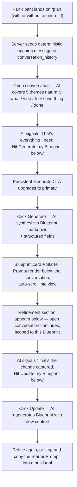
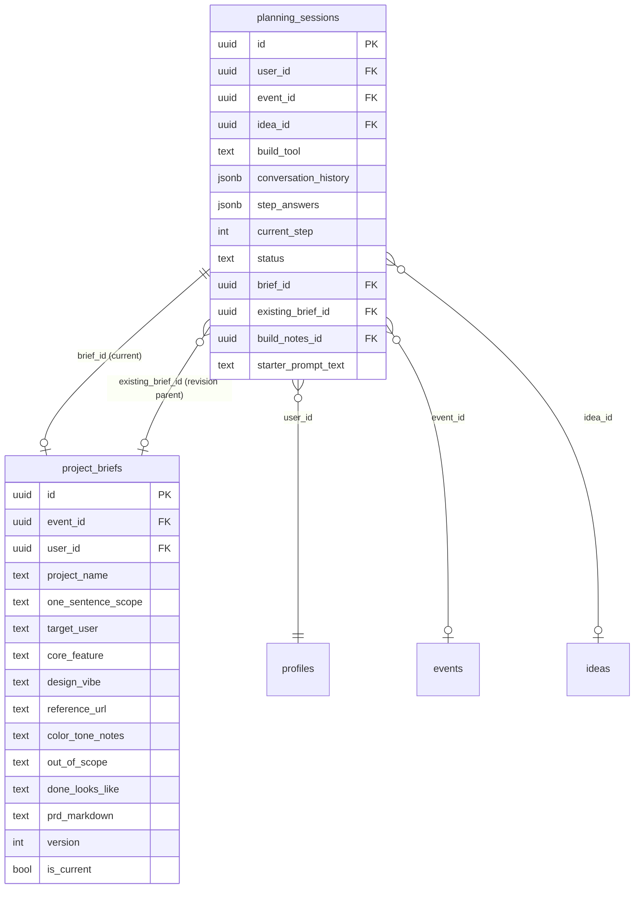

# Blueprint Flow — Implementation Reference

**Status:** As-built, live in production at `hacksathon.com/plan`
**Last updated:** May 2026
**Supersedes:** `zero-prmptr-enhancement-spec.md` (Apr 2026)

---

This doc captures the planning engine as it actually ships — the user-facing flow, the architecture, the AI prompt design, the UX patterns, and the failure modes we hardened against. If you're picking this up cold, read this first; the original spec was the starting point, but several core decisions changed during build and testing.

---

## 1. Vocabulary

Two parallel name systems, intentional:

| Internal name              | User-facing name                          | Notes                                                                                                |
| -------------------------- | ----------------------------------------- | ---------------------------------------------------------------------------------------------------- |
| ZERO.Prmptr / planning engine | **(never shown)**                         | Internal-only. Code/docs use ZERO.Prmptr; the participant never sees it.                             |
| Project brief / PRD        | **Blueprint**                             | The deliverable document. UI, AI, and copy all say "Blueprint." Never "PRD," "plan," "spec," "doc."  |
| Planning session           | **(implicit — the conversation)**         | Internal DB entity. Participants just have a conversation; they don't talk about "sessions."         |
| Starter Prompt             | **Starter Prompt**                        | Same name internal and external. The plain-text seed message for the build tool.                    |
| `prd_markdown` field       | The Blueprint content                     | DB column kept for migration continuity. New code should treat it as "Blueprint markdown."           |

Rule of thumb: if it's visible to a participant, it says "Blueprint." If it's only in code or DB, ZERO.Prmptr / PRD naming is fine.

---

## 2. Participant Journey

The full happy-path on `/plan`:



Key beats:

1. **Deterministic opening**: the very first AI message is template-seeded server-side (never an AI call). Removes a class of silent failure where a bad model ID would leave participants staring at an empty bubble. See `buildStep1Opening` in [hacksathon-app/src/lib/planning/prompts.ts](../hacksathon-app/src/lib/planning/prompts.ts).
2. **No step gate**: the conversation has no "advance" or "next step" button. The AI internally tracks five themes (what / who / feel / one thing / done) and decides on its own when there's enough material.
3. **Single Generate CTA, smart styling**: a persistent button below the input. Default state is quiet/bordered. When the AI's last message matches a ready-signal regex (`READY_PHRASES` in [planning-flow.tsx](../hacksathon-app/src/components/planning/planning-flow.tsx)), it upgrades to primary gradient styling with the helper text "You're ready — let's go." The AI voice and the UI feel like a single product.
4. **Blueprint is rich, not thin**: the AI synthesis is instructed to produce 1.5–2 pages of substantive content. A thin Blueprint is treated as a failure mode in the prompt.
5. **Refinement is also a conversation, not a one-shot edit**: once the Blueprint exists, the same open chat pattern continues below the Blueprint card. The AI is in "editing partner" mode and explicitly signals readiness with "Hit Update my Blueprint below" when changes are captured.

---

## 3. Architecture

### Files

```text
hacksathon-app/src/
├── app/
│   ├── (platform)/plan/
│   │   ├── page.tsx                         # Server route, auth gate, session bootstrap
│   │   └── planning-flow-wrapper.tsx        # Client wrapper, normalizes brief, handles initial fetch
│   └── api/planning/
│       ├── session/route.ts                 # POST: create planning_session, seed opening message
│       ├── step/route.ts                    # POST: stream a planning turn (also handles refinement)
│       ├── brief/route.ts                   # POST: synthesize Blueprint from full conversation
│       ├── starter-prompt/route.ts          # POST: deterministic template synthesis from brief fields
│       └── build-notes/                     # DEPRECATED — content now lives inside prd_markdown
├── components/planning/
│   ├── ai-message.tsx                       # Streaming-aware AI bubble
│   ├── planning-flow.tsx                    # ⭐ Main orchestrator — split thread, CTAs, scroll, state
│   ├── post-prd-input.tsx                   # Refinement textarea (simplified, no inline Update link)
│   ├── project-brief-card.tsx               # Blueprint card with header + footer action rows
│   ├── starter-prompt.tsx                   # Next Steps panel with prominent Copy Starter Prompt CTA
│   ├── user-input.tsx                       # Pre-Blueprint textarea + Send
│   └── (step-indicator.tsx, deprecated)
└── lib/
    ├── ai/model.ts                          # Centralized model ID (ANTHROPIC_PLANNING_MODEL override)
    └── planning/
        ├── prompts.ts                       # ⭐ buildSystemPrompt, buildPostPrdPrompt,
        │                                    #    buildStep1Opening, BRIEF_GENERATION_INSTRUCTION
        ├── context.ts                       # Session row mapping, message helpers
        ├── types.ts                         # Message, PlanningSession, ProjectBrief, etc.
        ├── steps.ts                         # Legacy — kept for reference, no longer used
        └── index.ts                         # Barrel export
```

### Data Model (Supabase)



Notes:
- `conversation_history` is the single source of truth for the chat. Structured `step_answers` is legacy and unused in the current flow.
- `prd_markdown` is the rendered Blueprint. Structured fields (`project_name` etc.) still exist as the data layer and are what `starter-prompt` reads from.
- `planning_sessions` has **two** foreign keys to `project_briefs` (`brief_id` and `existing_brief_id`). This means PostgREST implicit joins are ambiguous — always fetch the brief in a second explicit query. The starter-prompt route was broken for a release because of this.
- Migrations live in `hacksathon-app/supabase/migrations/`. Relevant ones: `00004_planning_sessions.sql` (core tables), `00005_prd_markdown.sql` (adds the consolidated markdown column).

### API Routes

| Route                                | Method | Purpose                                                                              |
| ------------------------------------ | ------ | ------------------------------------------------------------------------------------ |
| `/api/planning/session`              | POST   | Create a new planning session, look up idea name, seed `buildStep1Opening` as the first assistant message. |
| `/api/planning/step`                 | POST   | Append optional user message, stream AI response with full history as context. Detects post-Blueprint mode by `session.status === "complete"` and appends `buildPostPrdPrompt`. |
| `/api/planning/brief`                | POST   | Synthesize Blueprint from full conversation using `BRIEF_GENERATION_INSTRUCTION`. Supports `regenerate: true` for the refinement update path. Returns the full brief row. |
| `/api/planning/starter-prompt`       | POST   | Template-synthesize the Starter Prompt from brief structured fields. **Not an AI call** — deterministic. Caches in `planning_sessions.starter_prompt_text`. |
| `/api/planning/build-notes`          | -      | **Deprecated.** Build Notes content now lives inside `prd_markdown`.                 |

All routes auth-gate via Supabase server client. Streaming uses Vercel AI SDK v6 (`streamText` from `ai` package + `@ai-sdk/anthropic`). Model is `claude-sonnet-4-6`, configurable via `ANTHROPIC_PLANNING_MODEL` env var, centralized in [lib/ai/model.ts](../hacksathon-app/src/lib/ai/model.ts).

---

## 4. AI Prompt Design

Three prompts drive the engine, all in [prompts.ts](../hacksathon-app/src/lib/planning/prompts.ts):

### `buildSystemPrompt(ctx)` — pre-Blueprint conversation

Frames the AI as a "thinking partner" — a smart, curious, direct friend. Sets the tone (casual, warm, contraction-using). Defines the five themes the conversation has to cover. Forbids rigid form-style questions, sycophantic filler, and corporate phrasing. Tells the AI explicitly to close out with `"That's everything I need. Whenever you're ready, hit Generate my Blueprint below."` — this is the phrase `READY_PHRASES` detects.

### `buildPostPrdPrompt(prdMarkdown)` — refinement mode

Appended **on top of** the main system prompt whenever the session has a Blueprint. Reframes the AI as an editing partner; tells it to acknowledge, identify affected sections, briefly describe the update, and ask clarifying questions when scope is ambiguous. Includes:

- An explicit **Closing the refinement** section instructing the AI to say "Hit Update my Blueprint below" once changes are captured.
- A **CRITICAL** override stating the button label is "Update my Blueprint" (NOT "Generate my Blueprint"). The pre-Blueprint GOOD examples are so strong that without this explicit override, the AI was pattern-matching to "Generate my Blueprint" in refinement mode and confusing participants.
- BAD examples calling out the exact failure mode.
- Hard rules: never re-walk the five themes, never write the rewritten Blueprint in chat, never push the user to click before changes are actually captured.
- The current Blueprint markdown injected as context.

### `BRIEF_GENERATION_INSTRUCTION` — synthesis

Used when the user clicks Generate (or Update). Instructs the AI to return a single JSON object with both structured fields and a `prdMarkdown` string. The markdown has a fixed section template (verbatim emoji headers required) with explicit minimums per section:

- `What It Does`: two substantive paragraphs
- `Who It's For`: at least 120 words with named persona
- `How It Should Feel`: aesthetic + actionable design direction
- `The One Thing`: single-sentence helps statement + concrete moment
- `Features`: 3–5 core, 2–4 supporting, explicit out-of-scope
- `How Users Move Through It`: numbered primary flow + edge cases
- `Done When`: specific, 3-minute-demoable
- `Build Notes`: tensions, assumptions, optional v1/v2 split

Aim for 1.5–2 pages of content. Thin = failure mode. The brief route uses `maxOutputTokens: 6000` to give the model room.

### Ready-signal detection

Two regex arrays in [planning-flow.tsx](../hacksathon-app/src/components/planning/planning-flow.tsx) detect when the AI is signaling readiness. They drive purely visual CTA upgrades — the button is always clickable, the regex just changes the affordance.

| Constant                     | Mode                  | Sample phrases matched                                     |
| ---------------------------- | --------------------- | ---------------------------------------------------------- |
| `READY_PHRASES`              | Pre-Blueprint         | "That's everything I need", "ready to generate your blueprint", "hit Generate" |
| `POST_PRD_READY_PHRASES`     | Refinement            | "roll those in", "ready to update your blueprint", "that captures it" |

The post-PRD memo (`isReadyToUpdate`) is scoped to assistant messages **after** `briefSnapshotLength` so a "ready" phrase from the original conversation doesn't keep the Update CTA permanently primary across snapshots.

---

## 5. UX Patterns

### Continuous conversation, no steps

There's no "advance" button between topics. The AI drives the conversation freely. The UI exposes one persistent CTA below the input that the participant can hit at any time, but the styling cues them when the AI thinks they're ready.

### Split-thread layout (refinement)

Once a Blueprint exists, the rendered message thread is sliced at `briefSnapshotLength`:

```
┌──────────────────────────────────────────┐
│ Pre-Blueprint messages                   │  ← the chat that produced this Blueprint
│ (full history up to snapshot)            │
├──────────────────────────────────────────┤
│ Blueprint card (Copy · Download · PDF)   │  ← deliverable, repeated action rows
├──────────────────────────────────────────┤
│ Starter Prompt panel                     │  ← Next Steps + prominent Copy CTA
├──────────────────────────────────────────┤
│ "Refining your Blueprint" section header │
│ Post-Blueprint messages                  │  ← live continuation, scoped to this brief version
│ Textarea (conversational placeholder)    │
│ Smart Update CTA                         │
└──────────────────────────────────────────┘
```

When the AI streams a new response, it lands directly above the input — never separated by the Blueprint — so the participant doesn't have to hunt for it. The auto-scroll target switches to the post-Blueprint anchor (`postMessagesEndRef`) once refinement starts.

### Smart CTAs

`GenerateCTA` (pre) and `UpdateCTA` (post) follow the same pattern:

- Default: quiet bordered button, soft helper text below ("Hit Update when these changes feel right.")
- Ready: gradient-border primary, helper text changes to "Ready to roll those in."
- Disabled until at least one user turn exists in the relevant section.
- Updating state: label and helper reflect progress.

### Blueprint card actions

- **Header**: project label + Copy · Download .md · Save as PDF
- **Body**: rendered markdown with custom serif/sans typography
- **Footer (repeated action row)**: same three actions duplicated at the bottom because the Blueprint can run 1.5–2 pages and scrolling back to the top to act is friction.
- Copy buttons use the lucide `Copy` icon (line-art double-rect). On copied feedback, they swap to a `Check` icon paired with "Copied!" — meaningful confirmation, not just text.

### Starter Prompt panel

- "Next Steps — Build It" header
- 5 numbered instructions for taking the Blueprint to Lovable/Cursor/Bolt
- Prominent `Copy Starter Prompt` CTA sitting directly above the prompt box (not on the Blueprint card — the CTA lives next to what it copies)
- `The Prompt` box showing the rendered prompt with a small Copy link in its header (intentionally redundant — supports verification reads)
- Loading state shows a real spinner + "Preparing your Starter Prompt…" Error state shows a Retry button.

### Error handling philosophy

Every async layer surfaces failures visibly with a retry. We learned this the hard way: an invalid Anthropic model ID was failing silently, leaving the UI rendering an empty AI bubble. Now:

- `streamText.onError` logs to Vercel server logs with session ID + post-PRD flag
- Empty streams trigger a client-side error card with Retry (instead of persisting an empty bubble)
- Brief generation errors surface inline with Retry
- Starter Prompt fetch failures show a retry CTA in both the Blueprint footer and the Starter Prompt panel

### Print/PDF support

`window.print()` is wrapped in a stylesheet toggle. `html.printing-blueprint` class is added before printing; `@media print` and `.print-blueprint-area` CSS in `globals.css` hide all chrome so the resulting PDF is just the Blueprint document. The class is removed on `afterprint`.

---

## 6. Hardening — Failure modes we fixed

| Failure                                                                 | Symptom                                                              | Fix                                                                                                                                                |
| ----------------------------------------------------------------------- | -------------------------------------------------------------------- | -------------------------------------------------------------------------------------------------------------------------------------------------- |
| Invalid Anthropic model ID                                              | Empty AI bubble, silent failure on `/plan` Step 1                    | Centralized model ID in `lib/ai/model.ts`, added `onError` logging, made Step 1 opening deterministic (template-seeded, not AI-generated)          |
| Ambiguous FK join in `starter-prompt` route                             | Starter Prompt never populated; UI stuck on "Preparing..."           | Replaced `project_briefs!planning_sessions_brief_id_fkey` join with two explicit fetches (planning_sessions has two FKs to project_briefs)         |
| Blueprint generated above the fold while user was at the bottom         | User clicked Generate, saw nothing happen, looked confused           | Repositioned Blueprint card below the conversation + smooth-scroll into view on generation                                                          |
| "Print / PDF" terminology felt dated                                    | User confusion about what the action did                             | Renamed to "Save as PDF" (which is the actual destination in modern browser print dialogs)                                                         |
| Refinement felt like one-shot edit, not conversation                    | AI asked clarifying questions but user couldn't see them or respond  | Rebuilt as continuous conversation with split-thread layout + smart Update CTA + rewritten post-PRD prompt with explicit closing pattern           |
| AI saying "Hit Generate my Blueprint" during refinement                 | Button below says "Update my Blueprint" — mismatch confuses user     | Tightened `buildPostPrdPrompt` with CRITICAL override + BAD example + explicit NEVER rule on the word "Generate" in refinement mode                |

---

## 7. Open items / future considerations

**Deferred (not blocking launch):**
- Build Notes panel — content folded into `prd_markdown`; the structured `build_notes` table is unused but kept for migration continuity
- Legacy `steps.ts` — kept on disk for reference, no longer imported anywhere
- `step_answers` JSONB column — populated up through the rigid-step era, now ignored

**Worth considering later:**
- **Vercel AI Gateway**: would give us model fallbacks if Anthropic deprecates Sonnet 4.6 mid-event. Currently we rely on env-var override + visible error handling, which is acceptable but not bulletproof.
- **Versioned Blueprints**: `project_briefs.version` and `is_current` exist but aren't yet used. If we want a "view previous version" feature post-update, the schema is ready.
- **Streaming Blueprint generation**: today the Generate/Update spinner is "Generating your Blueprint…" with no progress signal until the full JSON is returned. Could stream the markdown as it generates for a more alive feel.
- **Idea → Blueprint linkage**: `planning_sessions.idea_id` is captured but the Blueprint doesn't yet show "Linked to: <idea name>" anywhere prominent. Worth surfacing once IdeaLab ships fully.
- **Organizer view of participant Blueprints**: completely unbuilt. Not needed for v1 (participants own their Blueprint), but a likely v2 feature for org dashboards.

---

## 8. Decisions worth remembering

A few non-obvious choices that pay off in maintenance:

1. **AI-instruction depth lives in prompts, not code.** The Blueprint is rich because `BRIEF_GENERATION_INSTRUCTION` demands minimums per section. If output ever feels thin again, the fix is in the prompt, not in stitching markdown together client-side.

2. **Internal product names never leak.** Search the codebase for "ZERO.Prmptr" — you'll find it in docs and comments. Search for it in any `.tsx` that renders user-facing copy — should be zero. Same for "PRD" in user-facing copy.

3. **Deterministic where possible.** First message, Starter Prompt, Blueprint download filename — all template synthesis, no AI calls. Each one removes a class of silent failure.

4. **Single source of truth for terminology.** UI says Blueprint, AI says Blueprint (enforced in prompts), filenames say Blueprint, internal docs can say PRD. If you have to introduce a new user-facing concept, name it once and grep for consistency.

5. **The conversation is the database.** `conversation_history` is the only thing the AI sees. Don't add side-channel state that the AI needs to know about — put it in the conversation, even if it's a synthetic "[Idea name set to X]" system message.
