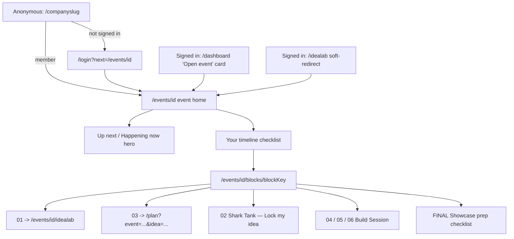
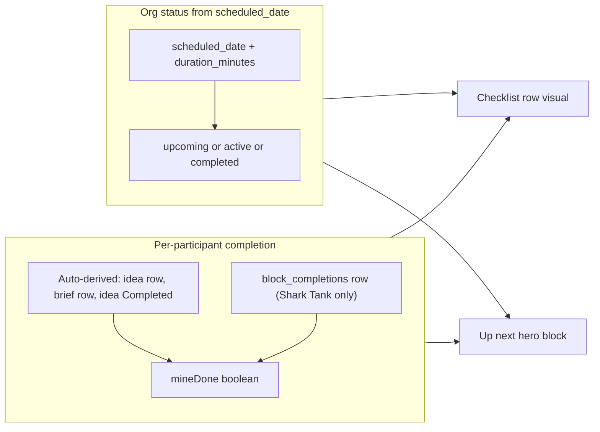
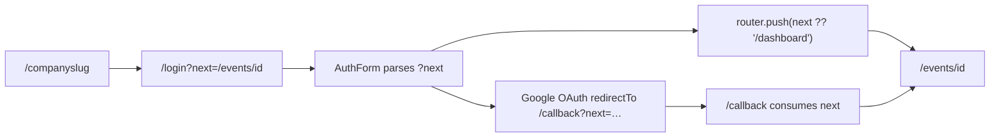

# Event Home & Block Screens — Implementation Reference

**Status:** As-built, live in production at `hacksathon.com/events/[id]` and `hacksathon.com/[companyslug]`
**Last updated:** May 2026
**Supersedes:** the M3 section of `hacksathon_production_launch_f571fa44.plan.md` and the M3 refinements plan (`m3_refinements_participant_progress_43fa6ac0.plan.md`)

---

This doc captures the participant event home, the dynamic block dispatcher and the ten per-block screens, the vanity URL handler, the hybrid completion model, and the brand-copy pass — all as they actually ship. M3 went through one round of click-through feedback ("M3 refinements") before settling here. If you're picking it up cold, this doc is the destination; both plan files were waypoints.

---

## 1. Vocabulary

Block-facing names are pinned and deliberate. Internal codenames (ZERO.Prmptr, etc.) do not leak into participant copy — same rule as the Blueprint flow.

| Concept                           | User-facing name                          | Notes                                                                                              |
| --------------------------------- | ----------------------------------------- | -------------------------------------------------------------------------------------------------- |
| The event landing page            | **(implicit — the event home)**           | No header literally says "Event home." The page leads with the org name and event title.           |
| The full list of blocks           | **Your timeline**                          | Section header above the checklist on `/events/[id]`.                                              |
| Hero CTA above the timeline       | **Up next** / **Happening now**           | "Happening now" when the next open block's `windowStatus === 'active'`. "Up next" otherwise.       |
| A scheduled-window-only label     | **Window closed**                          | Status badge on a block screen whose `scheduled_date + duration_minutes < now`. Distinct from `mineDone`. |
| Explicit completion on Shark Tank | **Lock my idea** → **Idea locked**         | Button label flips on success; the row's title also strikes through on the timeline.                |
| Event format                      | **Hacks-a-Thon** (hyphens)                | Always when referring to the event format, the participant's event, or the activity.                |
| The platform / domain             | **Hacksathon.com**                         | The product, the domain. Wordmark spans in layouts stay "Hacksathon."                              |
| Block key convention              | `ZERO`, `01`–`06`, `FINAL`, `+01`, `+02`  | Zero-padded so they sort lexicographically. `+01` / `+02` are post-Showcase bonus blocks.            |

| Block key | Title             | Notes                                                                                  |
| --------- | ----------------- | -------------------------------------------------------------------------------------- |
| `ZERO`    | Kickoff           | Read-only briefing screen.                                                              |
| `01`      | IdeaLab           | Dispatcher **redirects** to `/events/[id]/idealab`. Owns its own deliverable doc.       |
| `02`      | Shark Tank        | Pitch reminders + Lock my idea + Update your idea deep link.                            |
| `03`      | The Blueprint     | Dispatcher **redirects** to `/plan?event=…&tool=lovable&idea=…`. Owns its own deliverable doc. |
| `04`      | Build Session 1   | Encouragement + collapsed Blueprint + Starter Prompt (only when a Blueprint exists).    |
| `05`      | Build Session 2   | Encouragement + collapsed Blueprint + optional team-chat reminder.                       |
| `06`      | Build Session 3   | Same as `05`. Different tone copy ("Bring it home.").                                   |
| `FINAL`   | Showcase          | Demo-readiness checklist (Live URL, screenshot, idea status), deep links to fix gaps.   |
| `+01`     | Hacky Awards      | Placeholder card. Voting flows ship in M4.                                              |
| `+02`     | Reflections       | Placeholder card. Reflections form ships in M4.                                          |

Rule of thumb: warmer copy beats correct copy, and `Hacks-a-Thon` beats `hackathon` wherever it's about the event. The domain stays `Hacksathon.com`.

---

## 2. Participant Journey

Three entry points, one destination. Every route eventually resolves to `/events/[id]` or one of its block screens.



Key beats:

1. **Vanity URLs are soft entry, not landing pages.** `hacksathon.com/seven2` looks the participant up by `vanity_slug`, then redirects to `/events/[id]` if they're signed in and a member. Anonymous visitors see a branded sign-in card with `next=/events/[id]`.
2. **No "complete this block" button on the timeline.** Per-block completion is derived at read time. The only explicit completion CTA in M3 is `Lock my idea` on Shark Tank.
3. **`01` and `03` are dispatcher redirects, not inline screens.** IdeaLab and The Blueprint each own a deeper, dedicated flow; the block dispatcher just funnels the participant in.
4. **Build sessions split at `04`.** `04` is the kickoff session — full Starter Prompt + 5-step instructions, but only when a Blueprint exists. `05` and `06` strip the Starter Prompt entirely; they're continuation sessions, not new starts.
5. **The Slack card hides itself.** If `events.settings.slack_url` is missing, no card renders. No "an invite will appear here once your organizer adds it" placeholder.

---

## 3. Architecture

### Files

```text
hacksathon-app/src/
├── app/
│   ├── (platform)/
│   │   ├── dashboard/page.tsx                            # "Open event" card surfaces the user's primary event
│   │   ├── events/
│   │   │   ├── page.tsx                                  # Events index — list of cards or empty state
│   │   │   ├── new/
│   │   │   │   ├── page.tsx                              # Minimal create-event form
│   │   │   │   └── actions.ts                            # createMinimalEvent server action — seeds blocks from default template
│   │   │   └── [id]/
│   │   │       ├── page.tsx                              # ⭐ Event home — header, Up next hero, timeline, Slack card
│   │   │       ├── idealab/                              # IdeaLab routes — see idealab-implementation.md
│   │   │       └── blocks/
│   │   │           └── [blockKey]/page.tsx               # ⭐ Block dispatcher — one route, ten block screens
│   │   └── idealab/page.tsx                              # Soft redirect: 0 events → /events/new, 1 → /events/[id]/idealab, N → picker
│   ├── [companyslug]/page.tsx                            # ⭐ Vanity URL landing — reserved-slug guard + admin lookup
│   ├── (auth)/
│   │   ├── login/page.tsx                                # Wraps AuthForm in <Suspense> (useSearchParams)
│   │   └── signup/page.tsx                               # Same Suspense wrapper
│   └── api/blocks/complete/route.ts                      # POST: idempotent block_completions upsert
├── components/
│   ├── auth/auth-form.tsx                                # Honors ?next=… for post-auth redirect
│   ├── event-home/
│   │   └── block-checklist.tsx                           # ⭐ Visual list — date pill, status icon, strikethrough on mineDone
│   └── blocks/
│       ├── zero-screen.tsx                               # ZERO Kickoff — description + checklists
│       ├── shark-tank-screen.tsx                         # ⭐ 02 — pitch reminders + LockMyIdeaButton
│       ├── lock-my-idea-button.tsx                       # Client component — POST /api/blocks/complete + router.refresh()
│       ├── build-session.tsx                             # ⭐ 04 / 05 / 06 — split kickoff vs continuation
│       ├── showcase-prep.tsx                             # FINAL — checklist of demo-ready signals
│       ├── awards-placeholder.tsx                        # +01 placeholder
│       └── reflections-placeholder.tsx                   # +02 placeholder
└── lib/
    ├── blocks/
    │   └── status.ts                                     # ⭐ Pure helpers: deriveWindowStatus, isMineDone, nextOpenBlock, formatScheduledDate
    └── routing/
        └── reserved-slugs.ts                             # RESERVED_SLUGS set + isReservedSlug() — used by /[companyslug]
```

⭐ = core / most-edited.

### Data model snapshot

```text
events                                                          (new in M3)
├── welcome_message, welcome_video_url, logo_url                  -- header customization
└── vanity_slug                                                  -- /companyslug landing; case-insensitive unique index

blocks
├── block_key                                                    -- CHECK constraint pins to the 10-key vocabulary
└── (status column still exists; read path stops consulting it)  -- left in place for the M6 organizer wizard

block_completions                                                (new in M3)
├── event_id, user_id, block_key                                 -- unique together
├── completed_at                                                 -- defaults to now()
└── RLS: select/insert/delete are all WHERE user_id = auth.uid()
```

Notes:

- `blocks.status` is intentionally dead code in M3. We didn't drop it because the M6 organizer wizard may want a manual override later; for now the read path computes everything from `scheduled_date + duration_minutes + now()`.
- `block_completions` is the only schema addition that backs explicit completion. The auto-derive triggers (idea row, Blueprint row, idea status) read from existing tables.

---

## 4. Schema & Migrations Timeline

Three migrations under M3, applied in order:

| Migration                              | What it did                                                                                                                                                                                       | Why                                                                                                          |
| -------------------------------------- | ------------------------------------------------------------------------------------------------------------------------------------------------------------------------------------------------- | ------------------------------------------------------------------------------------------------------------ |
| `00013_event_home_fields.sql`          | Added `welcome_message`, `welcome_video_url`, `logo_url`, `vanity_slug` to `events`; case-insensitive unique partial index `events_vanity_slug_unique` on `lower(vanity_slug) WHERE NOT NULL`.    | Event home needs identity fields. Vanity URL needs uniqueness without forcing every event to have a slug.    |
| `00014_block_keys.sql`                  | Renamed legacy `zero/1/2/3/4a/4b/4c/final` rows to the Session 2 ten-key scheme; rewrote the default `event_templates.blocks` JSON; added `blocks_block_key_check` constraint.                    | Lock the block-key surface so app code can trust the enum. Application redirects in the dispatcher rely on it. |
| `00015_block_completions.sql`           | Created `block_completions(event_id, user_id, block_key)` with a unique constraint, an `idx_block_completions_event_user` index, RLS scoped to `auth.uid()`, and the same block-key CHECK.        | Back the `Lock my idea` flow. Generic schema so future explicit-completion CTAs don't need new plumbing.       |

The dropped-but-not-removed surface:

- `blocks.status` — still in the schema, no read path consults it after M3.
- The pre-M3 block keys (`zero`, `1`, `2`, `3`, `4a`, `4b`, `4c`, `final`) — migrated forward by `00014`; the CHECK constraint now rejects them.

---

## 5. Routing

Three entry points, one destination.

### Vanity URL (`/[companyslug]`)

[hacksathon-app/src/app/[companyslug]/page.tsx](../hacksathon-app/src/app/[companyslug]/page.tsx) is a catch-all at the root of the site. The flow:

1. Reject the slug if it's in `RESERVED_SLUGS` ([hacksathon-app/src/lib/routing/reserved-slugs.ts](../hacksathon-app/src/lib/routing/reserved-slugs.ts)). 404 lets the dedicated app route own the URL.
2. Look up the event by `vanity_slug` using the **admin client** — anonymous visitors don't have RLS access to private events, but we still want to render a branded sign-in card. Only identity fields are exposed (title, logo, welcome message).
3. If signed in **and** a member → `redirect("/events/[id]")`.
4. If signed in but not a member → "This is a private event" message with a Back-to-dashboard CTA.
5. If anonymous → branded sign-in card with `?next=/events/[id]` baked into both the Sign in and Create account links.

Reserved slugs (today): `api`, `login`, `signup`, `dashboard`, `events`, `plan`, `join`, `idealab`, `settings`, `pricing`, `case-study`, `showcase`, `forgot-password`, `reset-password`, `privacy`, `terms`, `admin`, `callback`. The M6 organizer wizard's vanity-availability check should reuse `isReservedSlug()` so organizers can't claim a slug we'd then collide with.

### Block dispatcher (`/events/[id]/blocks/[blockKey]`)

[hacksathon-app/src/app/(platform)/events/[id]/blocks/[blockKey]/page.tsx](../hacksathon-app/src/app/(platform)/events/[id]/blocks/[blockKey]/page.tsx) is one route serving ten blocks. The dispatcher:

1. Decodes the block key (`+01` / `+02` arrive percent-encoded from the checklist links).
2. Rejects anything outside the allowed set with `notFound()`.
3. Loads the user's idea up front (cheap, reused below).
4. Short-circuits for the two redirect-only blocks: `01` → `/events/[id]/idealab`, `03` → `/plan?event=…&tool=lovable&idea=…`.
5. Otherwise loads the event row + the specific block + a single-row `block_completions` lookup for this user / this block in a single `Promise.all`.
6. Renders the shared shell (back link, header, derived status badge, scheduled-date label) and dispatches to the appropriate `components/blocks/*.tsx` via the inner `BlockBody`.

### Other entry points

- `/dashboard` — "Open event" card surfaces the user's most recently-created event (when one exists). The IdeaLab card deep-links into the primary event's IdeaLab.
- `/idealab` — soft redirect: 0 events → `/events/new`; 1 event → `/events/[id]/idealab`; 2+ events → an inline picker. After `createMinimalEvent` runs the redirect target became `/events/[id]` (the event home) rather than IdeaLab directly.
- `/events` — list of cards, one per event the user belongs to. RLS already filters non-member events.

---

## 6. Block Status Derivation Model

Two signals, computed at read time. The organizer never marks anything by hand.



Effective rule per row:

- **Display status badge** = `windowStatus`. "Happening now" when active; "Window closed" when the window ended; "Upcoming" otherwise.
- **Personal completion** (`mineDone`) = `windowStatus === 'completed'` OR auto-derived from data OR row in `block_completions`. When `mineDone`, the row is muted with a check mark and the title is struck through.
- **"Up next" hero** = first block where `!mineDone`, preferring blocks where `windowStatus === 'active'`. Hidden when everything is `mineDone`.

Auto-derive rules:

| Block      | Trigger                                                                                         |
| ---------- | ----------------------------------------------------------------------------------------------- |
| `01`       | User has any `ideas` row for this event.                                                        |
| `03`       | User has any `project_briefs` row for this event.                                               |
| `FINAL`    | User's idea has `status='completed'`.                                                            |
| (others)   | No auto-derive — explicit completion (`02`) or time-window fallback only.                        |

Time-based fallback applies to every block: once `scheduled_date + duration_minutes < now`, the block reads as complete regardless of personal action. When no `scheduled_date` is set, the block stays upcoming until a personal-completion trigger fires — so today's reality (no dates set on most blocks) still produces a coherent IdeaLab → Blueprint → idea-complete progression.

The pure helpers live in [hacksathon-app/src/lib/blocks/status.ts](../hacksathon-app/src/lib/blocks/status.ts):

```ts
deriveWindowStatus(scheduledDate, durationMinutes, now): 'upcoming' | 'active' | 'completed'
isMineDone({ blockKey, windowStatus, completionsSet, hasIdea, hasBrief, ideaCompleted }): boolean
nextOpenBlock<T>(blocks): NextOpenBlockInput<T> | null
formatScheduledDate(scheduledDate): string | null   // "Sun, May 11 · 2:30 PM" via Intl.DateTimeFormat
```

No DB access in any of them. The event home pulls completions + brief presence + idea status in the same `Promise.all` as the blocks list and feeds the derived booleans into the checklist.

---

## 7. API Surface

```text
POST /api/blocks/complete
  Body: { eventId: uuid, blockKey: BlockKey }
  Auth: Supabase session required; returns 401 otherwise
  Validates:
    - eventId is non-empty string
    - blockKey ∈ ALL_BLOCK_KEYS (the 10-key vocabulary)
    - event row is visible to this user (RLS-gated SELECT; 403 if not a member)
  Behavior: upsert (event_id, user_id, block_key) with onConflict; idempotent
  Returns: { ok: true } or { error: string } with appropriate status
```

The route is generic on purpose — the body accepts any valid block key — even though today only Shark Tank's `Lock my idea` button calls it from the UI. M4 and M6 explicit-completion CTAs (reflections done, awards voted, etc.) can reuse it without new plumbing.

Idempotency comes from the table's `UNIQUE (event_id, user_id, block_key)` constraint plus `onConflict: 'event_id,user_id,block_key'` in the upsert. A double-tap during in-flight submission is harmless.

---

## 8. Component Tree

```text
EventHomePage  /events/[id]/page.tsx
├── Header (logo + org label + event title + welcome message + optional welcome video)
├── Up next hero card (only when nextOpenBlock !== null)
└── Your timeline
    └── BlockChecklist  components/event-home/block-checklist.tsx
        └── BlockChecklistItem × N
            ├── BlockBadge (block key pill)
            ├── Title + optional "Now" pill + date pill (Intl.DateTimeFormat)
            └── BlockStatusIcon (Check | Dot | Circle)
└── Slack card (only when settings.slack_url is set)

BlockPage  /events/[id]/blocks/[blockKey]/page.tsx
├── Back link
├── Header (block key + windowStatus badge + scheduled-date label)
└── BlockBody (dispatcher)
    ├── ZeroScreen           (ZERO)
    ├── SharkTankScreen      (02)  — embeds LockMyIdeaButton (client)
    ├── BuildSession         (04 / 05 / 06)
    │   ├── Encouragement card (mode-specific tone copy)
    │   ├── BlueprintDetails (collapsed <details>) or empty-state card
    │   ├── StarterPrompt (only when mode === '04' and a Blueprint exists)
    │   └── TeamChatReminder (only for 05/06 when slack_url is set)
    ├── ShowcasePrep         (FINAL)
    ├── AwardsPlaceholder    (+01)
    └── ReflectionsPlaceholder (+02)
```

The split inside `BuildSession` is the single biggest refinement-pass change to the dispatcher's children. See §9 for the per-block notes.

---

## 9. Per-Block Screens

| Block    | What renders                                                                                                                                                                                                                                                                                                              |
| -------- | -------------------------------------------------------------------------------------------------------------------------------------------------------------------------------------------------------------------------------------------------------------------------------------------------------------------------- |
| `ZERO`   | Read-only briefing: description + purpose paragraphs + any checklists JSON the template carries. No CTA.                                                                                                                                                                                                                  |
| `01`     | Dispatcher **redirect** to `/events/[id]/idealab`. The IdeaLab owns its full deliverable doc — see `idealab-implementation.md`.                                                                                                                                                                                            |
| `02`     | Pitch beats (Hook / The build / Why now) + an "After your pitch" card with two affordances: `LockMyIdeaButton` (Lock my idea → Idea locked) and a deep link to `/events/[id]/idealab/[ideaId]` for capturing feedback. When the participant has no idea yet the buttons collapse to a "Drop your idea first" CTA into `idealab/new`. |
| `03`     | Dispatcher **redirect** to `/plan?event=…&tool=lovable&idea=…`. The Blueprint flow owns its own deliverable doc — see `blueprint-flow-implementation.md`.                                                                                                                                                                  |
| `04`     | Kickoff build session. Encouragement card ("Let's go.") + collapsed Blueprint `<details>` card. **Conditional** on `blueprintMarkdown`: with one, renders the full `StarterPrompt` panel (5-step instructions + prominent Copy CTA). Without one, the `StarterPrompt` is suppressed entirely and the user sees an empty-state card pointing back to The Blueprint. |
| `05`     | Continuation session. Encouragement card ("Keep cooking.") + collapsed Blueprint `<details>` card. **No** Starter Prompt, no 5-step kickoff. A small "Stuck? Ask the room." card appears only when `slack_url` is set.                                                                                                     |
| `06`     | Same shape as `05`, different tone copy ("Bring it home.").                                                                                                                                                                                                                                                                |
| `FINAL`  | Showcase-prep checklist: Live URL ✓ / Final screenshot ✓ / Idea status = Completed. Each unchecked item deep-links into IdeaLab to fix it.                                                                                                                                                                                  |
| `+01`    | Placeholder card. "Voting opens after the Showcase block ends." Real voting UI ships in M4.                                                                                                                                                                                                                                |
| `+02`    | Placeholder card. "Reflections opens after the Showcase block ends." Real form ships in M4.                                                                                                                                                                                                                                |

The `04`/`05`/`06` split is the answer to the original click-through problem: when no Blueprint existed yet, `04` was rendering a misleading "Preparing your Starter Prompt…" spinner. The refinement-pass `BuildSession` now branches by `mode === '04' && blueprintMarkdown` to decide whether to render `StarterPrompt` at all, and outright drops it for `05`/`06` since those are continuation sessions, not new starts.

---

## 10. Auth + Redirect Flow

Vanity URLs and block deep links both rely on `?next=…` propagating cleanly through the auth flow:



Implementation details:

- [hacksathon-app/src/components/auth/auth-form.tsx](../hacksathon-app/src/components/auth/auth-form.tsx) reads `useSearchParams().get("next")` and runs it through a `safeNextPath()` allowlist (must start with `/`, no protocol, no `//`). The form's password sign-in calls `router.push(nextPath ?? "/dashboard")`; Google OAuth passes `redirectTo: ${origin}/callback?next=${encodeURIComponent(nextPath)}`.
- [hacksathon-app/src/app/callback/route.ts](../hacksathon-app/src/app/callback/route.ts) (pre-existing) already honored `next`; no change required.
- The Sign up / Log in cross-links in `AuthForm` also forward `next`, so toggling between modes mid-flow doesn't drop the destination.
- [hacksathon-app/src/app/(auth)/login/page.tsx](../hacksathon-app/src/app/(auth)/login/page.tsx) and [hacksathon-app/src/app/(auth)/signup/page.tsx](../hacksathon-app/src/app/(auth)/signup/page.tsx) wrap `<AuthForm>` in a `<Suspense fallback={…}>` boundary. This is **required** for the production build to succeed because `useSearchParams` triggers Next.js's static-prerender bail on these routes. Without the boundary, `next build` fails with `useSearchParams() should be wrapped in a suspense boundary at page "/signup"`.

---

## 11. Slack Card Behavior

Three surfaces conditionally render Slack content, all guarded by the same check:

```ts
const slackUrl =
  typeof eventRow.settings === "object" &&
  eventRow.settings !== null &&
  typeof (eventRow.settings as Record<string, unknown>).slack_url === "string"
    ? ((eventRow.settings as Record<string, unknown>).slack_url as string)
    : null;
```

When `slackUrl` is null, the surface renders nothing — there's no placeholder card, no "an invite will appear once your organizer adds it" copy.

| Surface                                                                                                                | Behavior when `slack_url` set                                                                  | Behavior when null |
| ---------------------------------------------------------------------------------------------------------------------- | ----------------------------------------------------------------------------------------------- | ------------------ |
| Event home — Team chat card                                                                                            | Renders "Team chat" card with "Open team chat" CTA.                                              | Card is omitted.    |
| Build sessions `05` / `06` — "Stuck? Ask the room." reminder                                                            | Renders the reminder card below the collapsed Blueprint.                                        | Card is omitted.    |
| Build session `04`                                                                                                     | No team-chat card. (The Starter Prompt panel is the focus of `04`.)                              | —                  |

The organizer-side UI for setting `slack_url` is **not** part of M3. It lives in `events.settings` JSONB and will be exposed by the M6 organizer wizard. For testing today, set it directly in Supabase:

```sql
UPDATE events
SET settings = COALESCE(settings, '{}'::jsonb) || jsonb_build_object('slack_url', 'https://…')
WHERE id = '…';
```

---

## 12. Brand & Copy Pass

Rule: **Hacks-a-Thon** (with hyphens) when referring to the event format, the activity, or a participant's event. **Hacksathon.com** for the platform and the domain. The wordmark logo in layout chrome stays "Hacksathon" — that's a typography choice the user wants to revisit later, not a copy issue.

Surfaces updated in the refinements pass:

- [hacksathon-app/src/app/layout.tsx](../hacksathon-app/src/app/layout.tsx) — root metadata `default` + `template` + `openGraph` titles and description.
- [hacksathon-app/src/app/(marketing)/page.tsx](../hacksathon-app/src/app/(marketing)/page.tsx) — hero badge, hero headline, sub-copy, primary CTA, bottom CTA.
- [hacksathon-app/src/app/(marketing)/pricing/page.tsx](../hacksathon-app/src/app/(marketing)/pricing/page.tsx) — page description, footer CTA.
- [hacksathon-app/src/app/(marketing)/showcase/page.tsx](../hacksathon-app/src/app/(marketing)/showcase/page.tsx) — both prose lines.
- [hacksathon-app/src/app/(marketing)/case-study/page.tsx](../hacksathon-app/src/app/(marketing)/case-study/page.tsx) — "The Hacks-a-Thon was structured…" and the bottom CTA.
- [hacksathon-app/src/app/(platform)/dashboard/page.tsx](../hacksathon-app/src/app/(platform)/dashboard/page.tsx) — "Create a Hacks-a-Thon", "Manage your active and past Hacks-a-Thons".
- [hacksathon-app/src/app/(platform)/events/page.tsx](../hacksathon-app/src/app/(platform)/events/page.tsx) — list intro + empty-state copy + "Create your first Hacks-a-Thon" CTA.
- [hacksathon-app/src/app/(platform)/events/new/new-event-form.tsx](../hacksathon-app/src/app/(platform)/events/new/new-event-form.tsx) — org-name helper text + event-title placeholder.
- [hacksathon-app/src/app/(platform)/events/[id]/page.tsx](../hacksathon-app/src/app/(platform)/events/[id]/page.tsx) — default welcome line "Welcome to your Hacks-a-Thon. Pick up wherever you left off."
- [hacksathon-app/src/app/[companyslug]/page.tsx](../hacksathon-app/src/app/[companyslug]/page.tsx) — anonymous-visitor card default copy "Sign in to jump back into your Hacks-a-Thon." Footer "Powered by Hacksathon.com" stays.
- [hacksathon-app/src/app/(auth)/login/page.tsx](../hacksathon-app/src/app/(auth)/login/page.tsx) — "Log in to your Hacksathon.com account".
- [hacksathon-app/src/app/(auth)/signup/page.tsx](../hacksathon-app/src/app/(auth)/signup/page.tsx) — "Start running Hacks-a-Thons at your company".
- [hacksathon-app/src/lib/planning/prompts.ts](../hacksathon-app/src/lib/planning/prompts.ts) — system-prompt framing line so the AI's voice matches the rest of the surface.

Intentionally skipped:

- Wordmark spans in [(platform)/layout.tsx](../hacksathon-app/src/app/(platform)/layout.tsx), [(marketing)/layout.tsx](../hacksathon-app/src/app/(marketing)/layout.tsx), [(auth)/layout.tsx](../hacksathon-app/src/app/(auth)/layout.tsx).
- The `idealab/new/page.tsx` code comment — internal-only, leaves no surface trace.
- `globals.css` brand comment — internal-only.

If you add a new surface, the test is simple: search for `hackathon` (case-insensitive) and confirm every match is either intentional (a wordmark span, a code comment) or wants the hyphens.

---

## 13. Failure Modes & Evolution

| Failure                                                                          | Symptom                                                                                       | Fix                                                                                                              |
| -------------------------------------------------------------------------------- | --------------------------------------------------------------------------------------------- | ---------------------------------------------------------------------------------------------------------------- |
| `useSearchParams` in a client component without a Suspense boundary               | `next build` failed: `useSearchParams() should be wrapped in a suspense boundary at page "/signup"`. | Wrapped `<AuthForm>` in `<Suspense fallback={…} />` in both `/login` and `/signup` page files. |
| Build session `04` showed "Preparing your Starter Prompt…" when no Blueprint existed | Participants stared at a spinner that would never resolve.                                     | `BuildSession` now branches on `blueprintMarkdown`; the Starter Prompt panel doesn't render at all without one. |
| Build sessions `05` and `06` repeated the 5-step kickoff instructions             | Felt redundant — the kickoff is a `04` moment, not a recurring one.                            | Stripped Starter Prompt + 5-step kickoff from `05`/`06`. Continuation sessions only show encouragement + collapsed Blueprint + optional team-chat reminder. |
| Slack card claimed an invite would appear "once your organizer adds it"           | Misleading placeholder for events that won't have a Slack at all.                              | Slack card now hides entirely when `slack_url` is null. Same rule on `05`/`06` reminder card.                    |
| `next/image` rejected dynamic Supabase Storage URLs for `logo_url`                | Build complained about un-allowlisted remote pattern.                                          | Event home + vanity shell use plain `` with a single `eslint-disable-next-line` for dynamic logos.          |
| Block dispatcher used stale stored `blocks.status` field                          | Status badge drifted from the clock; relied on organizer action that didn't exist yet.        | Read path now computes `windowStatus` from `scheduled_date + duration_minutes + now()`; stored column is ignored. |

### Known gaps (deferred)

- **Organizer scheduling UI is M6.** Without it, no block has a `scheduled_date`, so every `windowStatus` resolves to `upcoming` and the time-based fallback never fires. The auto-derive triggers (idea row, Blueprint row, idea Completed) and the explicit Shark Tank lock are the only paths to `mineDone` today. This is by design — those triggers cover the realistic participant journey for the first event we'll run on the platform.
- **Slack URL configuration UI is M6.** Set it directly in `events.settings.slack_url` via Supabase for now.
- **Explicit completion CTAs for `04` / `05` / `06`** were deliberately deferred. Time-based progression (and rolling back into `/plan` mid-build) is enough friction-saving. If we change our minds, the `/api/blocks/complete` route already accepts those keys — only the UI is missing.
- **Voting (`+01`) and Reflections (`+02`)** are placeholders. M4 ships the real forms.
- **`block_completions` on member removal** cascades via `user_id REFERENCES profiles(id) ON DELETE CASCADE`. If we ever surface "your team's progress" anywhere, we need to think about whether removed-member completions should be soft-deleted instead.

### Decisions worth remembering

1. **Read-time derivation beats stored state for participant progress.** No organizer ever has to mark a block "active" or "done." The clock and the data do it. The single explicit hook (Shark Tank) exists only because there is no other data signal that says "I gave my pitch."
2. **One dispatcher route, ten screens.** A flat `BlockBody` switch keeps the shared shell (back link, status badge, header) in one place. Adding an eleventh block in a future milestone is a one-file change.
3. **Vanity URLs lean on the admin client deliberately.** Anonymous landing has to show the branded card, which means bypassing RLS on identity-only fields. Anything beyond title / logo / welcome copy must NOT be exposed via the vanity path — the SELECT in `[companyslug]/page.tsx` is intentionally narrow.
4. **Block-key vocabulary is enforced at three layers.** TypeScript union in `lib/blocks/status.ts`, the runtime `ALL_BLOCK_KEYS` allowlist in `/api/blocks/complete`, and the Postgres CHECK constraint in `00014_block_keys.sql`. If a new block ever ships, all three need to update together.
5. **The Slack card disappears, not degrades.** Hiding beats a "coming soon" placeholder — same pattern we use elsewhere (no empty IdeaLab gallery state, no "your blueprint will appear here" stub). If the data isn't there, the surface isn't there.
