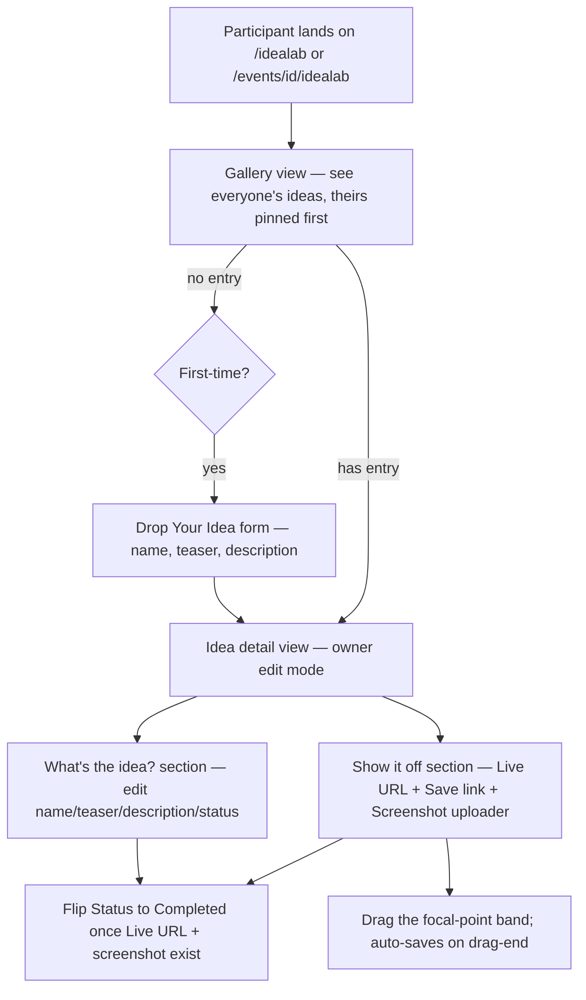

# IdeaLab — Implementation Reference

**Status:** As-built, live in production at `hacksathon.com/events/[id]/idealab`
**Last updated:** May 2026
**Supersedes:** the Milestone 2 plan (`milestone_2_idealab_c129cd22.plan.md`) and the screenshot upload spec embedded in the post-clickthrough polish plan

---

This doc captures the IdeaLab as it actually ships. The original M2 plan was the starting point, but the surface evolved noticeably during build and three rounds of click-through feedback. If you're picking this up cold, read this first; the original plan and the polish plans were waypoints, not the destination.

---

## 1. Vocabulary

Internal vs. user-facing names are intentionally aligned here — there's no internal codename layer to translate, unlike the Blueprint flow.

| Concept | User-facing name | Notes |
| --- | --- | --- |
| The whole feature | **IdeaLab** | Always capitalized this way, one word. Block `01` in the participant journey. |
| Submission form CTA | **Drop your idea** | Verb is deliberate. Not "Submit" — too formal for the tone. |
| The user's own row | "Your idea" | Singular. Each participant gets exactly one per event. |
| Idea name | **What should we call it?** | The DB column is `title`; the label is conversational. |
| Pitch | **Give us the teaser** | DB column is `pitch`, capped at 140 chars (Twitter-shaped). |
| Long description | **Got more to say? Spill it here.** | DB column is `description`, optional, capped at 500. |
| Live URL | **Live URL** | Hosted build URL. Required for the Completed state. |
| Final screenshot | **Final screenshot** | One PNG/JPG/WebP/GIF up to 5 MB. Required for Completed. |
| Status | **Where's it at?** | The select label inside the edit form. Options are *In Progress* / *Completed*. |
| Crop tool | "Pick what shows on the card" / no header | Inline UI inside the screenshot uploader. |

Rule of thumb: warmer copy beats correct copy. The whole IdeaLab tone was tightened in the M2 cleanup pass to read like a teammate, not a form.

---

## 2. Participant Journey



Key beats:

1. **One entry per participant per event**, enforced by a unique partial index (`ideas_one_per_user_per_event`). The submission form server-side redirects to the existing idea if the user already has one.
2. **In Progress is the default**, not *idea stage*. The legacy `idea_stage` enum value rolls up to "In Progress" in the UI — it's an artifact of the original schema before this flow existed.
3. **Completed is gated**, both at the DB level (`ideas_completed_requires_demo_assets` CHECK constraint) and in the UI (the *Completed* option is disabled until `liveUrl` and `finalScreenshotUrl` both exist). The select dropdown disables the option; the API also re-validates so a crafted PATCH can't bypass it.
4. **Removing the screenshot rolls Completed back to In Progress.** Without this, the DB CHECK constraint would block the delete. The remove flow PATCHes URL clear + crop reset + status flip in one round trip.
5. **Per-section save, not page-wide.** *Save changes* writes title/teaser/description/status (kept inline together because they're one logical block — see §8). *Save link* is its own button next to the Live URL, with inline validation. Crop drag and screenshot upload auto-save with a visible *Saving… / Saved.* indicator.

---

## 3. Architecture

### Files

```text
hacksathon-app/src/
├── app/
│   ├── (platform)/
│   │   ├── idealab/page.tsx                          # Soft redirect: 0 events → /events/new, 1 → /events/[id]/idealab, N → picker
│   │   └── events/
│   │       ├── new/page.tsx                          # Minimal create-event form
│   │       ├── new/actions.ts                        # createMinimalEvent server action (orgs, members, events)
│   │       └── [id]/idealab/
│   │           ├── page.tsx                          # Gallery view, owner's card pinned first
│   │           ├── new/page.tsx                      # Submission form route, server-side dupe check
│   │           └── [ideaId]/page.tsx                 # Detail view, hands off to IdeaDetail
│   └── api/ideas/
│       ├── route.ts                                  # POST: create idea (one-per-user enforced)
│       └── [id]/route.ts                             # PATCH: update fields, validate URL + crop ranges
├── components/idealab/
│   ├── idea-form.tsx                                 # ⭐ Submission form (client) — char counters, tone copy
│   ├── idea-detail.tsx                               # ⭐ Owner edit view + read-only non-owner branch
│   ├── idea-card.tsx                                 # Gallery tile
│   ├── screenshot-uploader.tsx                       # ⭐ Drop zone + crop tool + Replace/Remove
│   └── char-counter.tsx                              # Tiny "N/MAX characters" helper
└── lib/idealab/
    ├── types.ts                                      # Idea interface, rowToIdea, IDEA_FIELD_LIMITS, status helpers
    └── url.ts                                        # isValidHttpUrl() — used client + server
```

⭐ = core / most-edited.

### Data model snapshot

```text
ideas
├── id, event_id, user_id
├── title, pitch, description
├── status (idea_stage | in_progress | completed) — defaults to in_progress
├── project_url, live_url, final_screenshot_url
├── hero_crop_x, hero_crop_y                          # 0..100, default 50 each
└── created_at, updated_at

Constraints
├── ideas_one_per_user_per_event                      # unique (event_id, user_id)
├── ideas_completed_requires_demo_assets              # CHECK status != completed OR (live_url, final_screenshot_url) populated
├── ideas_hero_crop_x_range, ideas_hero_crop_y_range  # CHECK 0..100
└── RLS: event-member SELECT, owner-only INSERT/UPDATE/DELETE
```

---

## 4. Schema & Migrations Timeline

The schema evolved across seven migrations after the M2 baseline. Reading the migrations in order tells the story of the polish passes.

| Migration | What it did | Why |
| --- | --- | --- |
| `00006_idealab.sql` | Added `live_url`, `final_screenshot_url`, `category`; unique index; CHECK constraint; status default `in_progress` | Initial M2 baseline |
| `00007_idea_screenshots.sql` | Created `idea-screenshots` storage bucket + RLS on `{event_id}/{user_id}/…` path | First storage iteration |
| `00009_drop_idea_category.sql` | Removed `category` column + check constraint | Field wasn't in original scope; cut in tone-cleanup pass |
| `00010_idea_hero_crop.sql` | Added `hero_crop_y INT NOT NULL DEFAULT 50` + 0..100 CHECK | Vertical focal-point crop |
| `00011_idea_screenshots_by_idea.sql` | Re-keyed the bucket from `{event_id}/{user_id}/…` to `{idea_id}/{uuid}.{ext}`, RLS gated by `ideas.user_id` | UUID filenames make URLs immutable; per-idea folders are easy to clean |
| `00012_idea_hero_crop_x.sql` | Added `hero_crop_x INT NOT NULL DEFAULT 50` + 0..100 CHECK | Horizontal focal-point crop for wide images |

Out-of-sequence migrations: `00008_fix_rls_recursion.sql` lives between 7 and 9 but addressed the cross-cutting `organization_members` RLS recursion that surfaced during M2 click-through; it's not IdeaLab-specific.

The `category` column was dropped (`00009`) rather than re-purposed. It's a one-way change — no fallback exists if we re-introduce categorization, which is fine because the feedback was clear: categories were not in scope.

---

## 5. Storage Architecture

Direct client → Supabase Storage, no signed URLs, no intermediate API route.

```text
Bucket: idea-screenshots (public read)
Path:   {idea_id}/{uuid}.{ext}
RLS:    INSERT/UPDATE/DELETE require ideas.user_id = auth.uid()
        SELECT is open (public bucket — gallery thumbs need to render anonymously later)
```

Key decisions:

- **UUID filenames** make every upload's URL unique. No `upsert`, no `?v={timestamp}` cache-buster. The previous scheme used a fixed `screenshot.{ext}` per user per event, which forced a cache-buster query param to defeat browser caching after replace.
- **Folder per idea** means deleting an idea cascade-cleans by folder. The RLS check uses `(storage.foldername(name))[1]` against `ideas.id::text`.
- **One screenshot per idea**. The spec we pulled in supported up to 3 with reordering; for this build we collapsed to a single `final_screenshot_url`. The "final" framing matches the completion-gating model — this is the screenshot the participant submits at Showcase, not a gallery.
- **Orphans on remove** are accepted. When a screenshot is replaced, the old file stays in storage until the idea is deleted. Cheap to ignore; non-destructive plan documented in the polish plan.

---

## 6. API Surface

```text
POST /api/ideas
  Body: { eventId, title, pitch, description? }
  Validates: title and pitch non-empty after trim; description optional
  Auth: must be signed in + member of the event's organization
  Enforces: one-per-user-per-event (returns 409 if duplicate)
  Returns: { idea: Idea }

PATCH /api/ideas/[id]
  Body: any subset of { title, pitch, description, liveUrl, finalScreenshotUrl, heroCropX, heroCropY, status }
  Validates:
    - title, pitch: non-empty if present
    - liveUrl: isValidHttpUrl() if non-empty; "" or null clears
    - heroCropX, heroCropY: integer 0..100 if present
    - status='completed' requires both live_url and final_screenshot_url
  Auth: owner only (re-checks user_id against existing.user_id)
  Returns: { idea: Idea }
```

Patch is a partial-update endpoint — the client only sends the keys that changed. This makes auto-save flows (status flip, crop drag, screenshot upload) cheap: one PATCH per axis, small payload.

`isValidHttpUrl(value)` lives in [hacksathon-app/src/lib/idealab/url.ts](../hacksathon-app/src/lib/idealab/url.ts) and is shared between the client-side Save link button and the server-side PATCH route. Empty string is *valid* and treated as "clear the field." Anything non-empty must parse as a URL with `http:` or `https:` protocol.

---

## 7. Component Tree

```text
IdeaForm (submission)
└── inputs + CharCounter × 3

IdeaDetail (owner edit + non-owner read)
├── Header card (Sparkles badge, title, status badge)
├── "What's the idea?" section
│   ├── title input + CharCounter
│   ├── pitch input + CharCounter
│   ├── description textarea + CharCounter
│   ├── Where's it at? Select  ← auto-saves on change
│   └── Save changes button
└── "Show it off" section
    ├── Live URL input + Save link button (separate save lane)
    └── ScreenshotUploader
        ├── Empty state — drop zone
        └── Loaded state — crop tool + Replace / Remove

IdeaCard (gallery tile)
└── 16:9 thumbnail with object-position from heroCropX/heroCropY
```

The non-owner branch of `IdeaDetail` renders a read-only version with section headers *The teaser*, *More about it*, *Live URL*, *Final screenshot*. The screenshot block honors the saved crop, so visitors see exactly what the owner picked.

---

## 8. Copy & Tone

The form-and-field copy is the result of a deliberate tone pass after the first click-through. The rule the user gave: read like a teammate, not a form.

| Field | Label | Placeholder / helper |
| --- | --- | --- |
| Title | *What should we call it? \** | *e.g., AI-powered customer support that actually gets it* |
| Pitch | *Give us the teaser — 140 characters or less \** | *The one-liner that'll make everyone go "wait, what?!"* |
| Description | *Got more to say? Spill it here.* | *Dive deeper into your wild idea…* |
| Status | *Where's it at?* | *Flip to **Completed** once your link and screenshot are in.* |
| Submit button | **Drop my idea** | (subtitle on the form: *Keep it short, sweet, and a little bit wild. One spark is all it takes.*) |
| Save flash | *Saved it.* | (same phrase across the page) |
| Removal toast | *Your idea is back to In Progress.* | only when removing a screenshot rolls a Completed idea back |

The Sparkles badge (a `Sparkles` icon from `lucide-react` in a circle) sits next to the heading on the submission form. It's small but it carries most of the playfulness on an otherwise text-heavy screen.

Status placement: originally a standalone *Where's it at?* section sat at the bottom of the page. It moved inline with the basics in the post-clickthrough polish round — status is a property of the idea, not a separate concern.

---

## 9. Focal-Point Crop Math

The crop is intentionally CSS-only — we save percentages and let `object-position` move the visible 16:9 window on the original image at render time. No image processing, no Sharp, no edge functions.

### Axis selection

`object-cover` in a 16:9 container only crops one direction. The uploader detects which:

```ts
const cropAxis: "x" | "y" | null = useMemo(() => {
  if (!heroNaturalSize) return "y";
  const r = heroNaturalSize.w / heroNaturalSize.h;
  if (r > 16 / 9) return "x";
  if (r < 16 / 9) return "y";
  return null;                                 // exactly 16:9 — nothing to crop
}, [heroNaturalSize]);
```

Tall image → vertical band slides up/down → persists `hero_crop_y`. Wide image → vertical band slides left/right → persists `hero_crop_x`. Exactly-16:9 → the crop tool hides and helper reads *This image already fills the card. Nothing to crop.*

### Slice geometry

```ts
const sliceSize = useMemo(() => {
  if (!heroNaturalSize || !cropAxis) return 100;
  const { w, h } = heroNaturalSize;
  if (cropAxis === "y") return Math.min(100, (9 / 16) * (w / h) * 100);
  return Math.min(100, (16 / 9) * (h / w) * 100);
}, [heroNaturalSize, cropAxis]);
```

`sliceSize` is the visible 16:9 slice along the active axis as a percentage of the full image. As the crop value goes 0..100, the band's leading edge slides linearly from 0% to `(100 − sliceSize)%`:

```ts
const bandStart = (activeCrop * (100 - sliceSize)) / 100;
const bandSize  = sliceSize;
```

This keeps the band fully inside the image at the extremes (no overhang) and means the band visually represents exactly what `object-cover` will reveal at `object-position: {X}% {Y}%`.

### Pointer mapping

The band *center* follows the pointer, with the value clamped to [0, 100]:

```ts
const next = Math.round(
  Math.max(0, Math.min(100,
    ((pointerPct - sliceSize / 2) * 100) / (100 - sliceSize)
  ))
);
```

Pointer positions inside half-a-slice of an edge park the value at 0 or 100, snapping the band flush against the edge. Felt better than allowing the pointer to "outrun" the band.

### Cached-image gotcha

``'s `load` event can fire before React attaches `onLoad` when the image is already in the browser cache. That would leave `heroNaturalSize` null forever and the crop tool stuck in the *nothing to crop* state. Fix: a `useEffect` keyed to `currentUrl` that reads `img.complete && naturalWidth > 0` from a ref and populates the state directly. `onLoad` is still there for fresh loads.

---

## 10. Auto-Save Patterns

The page has three save lanes, each with different feedback shapes.

| Lane | Trigger | Feedback |
| --- | --- | --- |
| Core fields (title / pitch / description) | Explicit **Save changes** button | *Saved it.* flash next to the button |
| Live URL | Explicit **Save link** button | *Saved it.* flash + inline `urlError` on validation fail |
| Status | Select `onValueChange` | *Updating…* indicator next to the label |
| Crop drag | Pointer-up (drag end) | Spinner + *Saving…* → *Saved.* flash in the crop tool helper row |
| Screenshot upload | File picked / dropped | *Uploading…* state on the drop zone; sonner toast on error |
| Screenshot remove | Click **Remove** | *Removing…* spinner; toast on error; *Your idea is back to In Progress.* toast if status flipped |

The rule we settled on: **explicit Save for content the user is composing** (text fields, URL — they need to know exactly when they've committed), **auto-save for binary choices** (status flip, focal point drag, file pick). The crop's *Saving… / Saved.* indicator was a specific fix for the auto-save feeling silent — once you can see the save happen, the auto-save model holds up.

Validation errors route through inline copy on the live URL (field-level), through a small destructive line under the status select (when the API rejects a Completed flip), and through `sonner` toasts on storage / unexpected failures.

---

## 11. Validation Rules

| Field | Constraint | Enforced |
| --- | --- | --- |
| `title` | 1–80 chars after trim | Client (`IDEA_FIELD_LIMITS.title`, `maxLength`) + server |
| `pitch` | 1–140 chars after trim | Client + server |
| `description` | 0–500 chars | Client + server |
| `live_url` | empty OR valid http/https URL | Client (`isValidHttpUrl`) + server |
| `hero_crop_x`, `hero_crop_y` | integer 0..100 | Client (math) + server + DB CHECK |
| `status='completed'` | requires both demo assets | Client (select disabled) + server + DB CHECK |
| One entry per user per event | unique index | DB; client surfaces via 409 on POST |

`IDEA_FIELD_LIMITS` in [hacksathon-app/src/lib/idealab/types.ts](../hacksathon-app/src/lib/idealab/types.ts) is the single source of truth for the three length caps. The `CharCounter` reads from the same constants, so when limits move, every counter and `maxLength` follows.

---

## 12. Failure Modes Hardened Against

A short list of failure modes that surfaced during testing and what we did about them:

- **Empty / silent crop tool on revisit** → cached-image fix in §9 (ref + effect).
- **Band could be dragged off the image** → linear-slide band positioning in §9.
- **Status flipping back to In Progress when removing a Completed idea's screenshot blocked by DB CHECK** → single PATCH with URL + crop reset + conditional status flip + a `toast.info` so the user knows it happened.
- **Live URL save tangled with the main Save changes button** → split into its own Save link button so URL validation error doesn't block other edits, and so changing the URL doesn't accidentally PATCH unrelated fields.
- **Replace orphaning the old file** → accepted as harmless trade-off; UUID filenames make collisions impossible.
- **Save indicator on auto-save invisible** → explicit *Saving… / Saved.* indicator next to the helper line.
- **Submission while user already has an idea** → server-side redirect on the `/new` route to the existing idea; the API also rejects with 409 as a backstop.

---

## 13. What's intentionally simple

A few things we deliberately did *not* build:

- No image processing pipeline. Originals stored as-is, cropping is purely a CSS overlay.
- No lightbox / fullscreen viewer for the screenshot.
- No drag-to-reorder (single-screenshot model).
- No two-axis cropping for non-16:9 images. `object-cover` only crops one direction per frame; a second axis would be cosmetic noise.
- No "fit / fill" toggle. Crop tool is implicit from orientation.
- No category / tag / theme metadata. Cut in `00009` because the feedback was unambiguous and no other surface depends on it.

If any of these come back as requirements, the focal-point crop math and the per-section save patterns extend cleanly. The schema is already in good shape for them.

---

## 14. Pointers for the next person in the file

- **Tone changes** → update `IdeaForm`, `IdeaDetail`, the gallery page, and any toast strings. Tone is consistent across all four surfaces; if you change one, audit the others.
- **Field limit changes** → bump `IDEA_FIELD_LIMITS` in `lib/idealab/types.ts`. Counters and `maxLength` follow automatically; check that the server `if (!body.title.trim())` validation still feels right at the new cap.
- **Adding a field** → add the column in a new migration with a sensible default (so existing rows don't break the CHECK constraints), expose it in `Idea` and `rowToIdea`, and add the PATCH branch in `[id]/route.ts`. The submission form may not need it if it's optional.
- **Storage policy changes** → coordinate with the path scheme. Current: `{idea_id}/{uuid}.{ext}` gated by `ideas.user_id`. The RLS check parses the folder name and joins back to `ideas`.
- **Block 01 hookup** → the participant event home in M3 will deep-link to `/events/[id]/idealab` for block `01`. No changes needed on the IdeaLab side.
