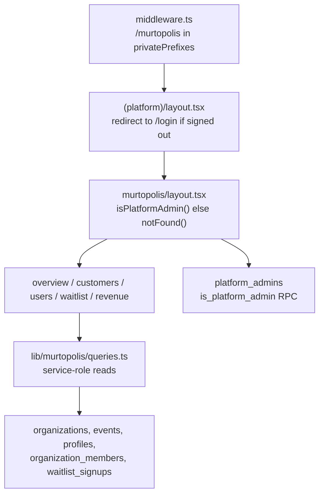

# Murtopolis Owner Dashboard — Implementation Handoff

> Status as of June 2026. This documents a feature that was built in the
> shared working tree (not a separate branch). It is fully implemented,
> typechecks, lints, and `next build` passes — but it has **not been
> committed or deployed**. This doc exists so another agent can get up to
> speed without the original chat context.

---

## 1. What this is

**Murtopolis** is the **platform-owner console** for Hacksathon.com — a
private admin area for the SaaS *owner* (Nick / Murtopolis), as opposed
to the per-event organizer admin that already lives at
`/[companyslug]/admin`.

It answers owner-level questions: How many customers do we have? Who is
paying vs. on a demo? How many users and how active are they? Who is on
the waitlist? What's our revenue?

- Lives at **`/murtopolis`** (the name was already reserved for this in
  the planning docs).
- Gated by the **pre-existing** `platform_admins` table + `is_platform_admin()`
  RPC (these existed in the DB before this work; nothing in the app used
  them until now).
- Reuses the authenticated `(platform)` shell (header, `UserMenu`, footer)
  and the existing grayscale design system.

### Distinction from the event admin

| | Event admin | Murtopolis (this work) |
| --- | --- | --- |
| URL | `/[companyslug]/admin` | `/murtopolis` |
| Who | Org/event admin (`organization_members.role = 'admin'`) | Platform owner (`platform_admins`) |
| Gate | `is_event_admin(p_event_id)` RPC | `is_platform_admin()` RPC |
| Scope | One org/event | Cross-tenant (all orgs, users, waitlist) |
| Guard helper | `requireEventAdmin()` | `requirePlatformAdmin()` (new) |

---

## 2. How to get access (required to even see it)

Access is allowlist-based. A user only sees Murtopolis if their `user_id`
is in the `platform_admins` table. There is **no self-serve UI** to grant
this (by design). Seed it with SQL in Supabase:

```sql
insert into platform_admins (user_id)
select id from auth.users where email = 'you@example.com'
on conflict do nothing;
```

The owner's account has already been seeded once via this query.

Runtime requirement: the dashboard reads cross-tenant data with the
service-role client, so **`SUPABASE_SERVICE_ROLE_KEY` must be set** in the
environment (same key the waitlist API already uses).

---

## 3. Routes

All routes are under the `(platform)` route group, so they share the
authenticated shell and are server-rendered on demand (dynamic).

| Route | File | Purpose |
| --- | --- | --- |
| `/murtopolis` | `(platform)/murtopolis/page.tsx` | Overview: KPI tiles, 30-day growth chart, newest customers |
| `/murtopolis/customers` | `(platform)/murtopolis/customers/page.tsx` | Org table with search / billing filter / sort |
| `/murtopolis/customers/[orgId]` | `(platform)/murtopolis/customers/[orgId]/page.tsx` | Customer detail: billing, Stripe link, events, roster |
| `/murtopolis/users` | `(platform)/murtopolis/users/page.tsx` | All accounts, activity, admin-somewhere flag |
| `/murtopolis/waitlist` | `(platform)/murtopolis/waitlist/page.tsx` | Leads with team-size / source / notified filters |
| `/murtopolis/revenue` | `(platform)/murtopolis/revenue/page.tsx` | Totals, 12-month chart, breakdown by payment status |

Layout + loading skeleton:
- `(platform)/murtopolis/layout.tsx` — platform-admin gate (404 for
  non-admins) + page header + sub-nav.
- `(platform)/murtopolis/loading.tsx` — segment loading skeleton.



---

## 4. Files added (16)

All paths are under `hacksathon-app/`.

### Auth / guard

- **`src/lib/server/platform-admin-guard.ts`** — mirrors the existing
  `event-admin-guard.ts`. Exports:
  - `requirePlatformAdmin()` → `Promise<PlatformAdminContext | NextResponse>`.
    For API routes: returns `{ userId, supabase }` on success, or a 401/403
    `NextResponse` the caller can return directly.
  - `isPlatformAdmin()` → `Promise<boolean>`. Wrapped in React `cache()`
    so the RPC runs at most once per request. Returns `false` for
    signed-out users. Used by layouts and the `UserMenu`.
  - `isErrorResponse(value)` — type guard for the union return.

  Both call the `is_platform_admin()` SECURITY DEFINER RPC (no args).

### Data layer

- **`src/lib/murtopolis/queries.ts`** — all owner analytics (see §6).
- **`src/lib/murtopolis/format.ts`** — `formatCurrencyFromCents`,
  `formatNumber`, `formatDate`, `paymentStatusLabel`.

### Components (`src/components/murtopolis/`)

- **`murtopolis-subnav.tsx`** — horizontal numbered tab nav
  (`00 Overview … 04 Waitlist`), cloned in spirit from
  `event-nav/admin-subnav.tsx`. Client component (`usePathname`).
- **`metric-card.tsx`** — KPI tile (mono label, big serif number, hint,
  optional corner tag). Server component.
- **`trend-chart.tsx`** — the only Recharts consumer. Monochrome
  `ComposedChart` supporting line and bar series on one grid. Client
  component.
- **`murtopolis-toolbar.tsx`** — shared search + filter toolbar. Writes
  state to the URL (`useRouter`/`useSearchParams`), debounced search,
  `useTransition` for responsiveness. Client component.
- **`panel.tsx`** — exports `Panel` (titled section), `EmptyState`, and
  `PaymentStateBadge` (grayscale customer billing badge).

### Pages (`src/app/(platform)/murtopolis/`)

- `layout.tsx`, `page.tsx`, `loading.tsx`
- `customers/page.tsx`, `customers/[orgId]/page.tsx`
- `users/page.tsx`, `waitlist/page.tsx`, `revenue/page.tsx`

---

## 5. Files modified (4 source + 2 lockfiles)

- **`src/lib/supabase/middleware.ts`** — added `"/murtopolis"` to the
  `privatePrefixes` array so unauthenticated hits redirect to login at the
  edge (consistent with `/dashboard`, `/settings`, etc.).
- **`src/components/site/user-menu.tsx`** — added an optional
  `isPlatformAdmin?: boolean` prop. When true, renders a `Murtopolis`
  link at the top of the account dropdown. Non-admins never receive the
  prop as `true`, so they never see the entry point.
- **`src/app/(platform)/layout.tsx`** — calls `isPlatformAdmin()` and
  passes the result to `<UserMenu isPlatformAdmin={...} />`.
- **`src/app/[companyslug]/layout.tsx`** — same `UserMenu` wiring (so the
  link also appears while the owner is inside a slug/event surface).
- **`package.json` / `package-lock.json`** — added `recharts@^3`.

> Note: these are the only changes from *this* work. The working tree
> contains a large amount of *unrelated* uncommitted work from the other
> agent; see §10.

---

## 6. Data-layer reference (`src/lib/murtopolis/queries.ts`)

**Golden rule:** every export uses `createAdminClient()` (service-role,
RLS-bypassing) and **assumes the caller already passed the platform-admin
gate**. These must only be imported from server code under `/murtopolis`,
which is gated by the layout. Service-role is required because
`waitlist_signups` has no read policy and org/profile RLS is per-tenant.

Aggregation is done in JS (fetch rows, reduce) rather than SQL views — fine
for current scale, avoids schema churn. If volume grows, these are the
natural candidates to move into SQL/RPC.

| Function | Returns | Reads |
| --- | --- | --- |
| `getOverviewMetrics()` | `OverviewMetrics` — totalOrgs, payingOrgs, demoOrgs, totalUsers, activeUsers7d/30d, newUsers30d, waitlistCount, totalEvents, payingEvents, seatsSold, totalRevenueCents, monthRevenueCents | `organizations`, `profiles`, `waitlist_signups` (counts), `events` (rows) |
| `getSignupSeries(days=30)` | `SignupSeriesPoint[]` — `{ date (YYYY-MM-DD), orgs, users, waitlist }`, one entry per day (zero-filled) | `organizations`, `profiles`, `waitlist_signups` (created_at) |
| `listCustomers({ search?, paymentState?, sort? })` | `CustomerSummary[]` | full customer dataset (see below) |
| `getCustomerDetail(orgId)` | `CustomerDetail \| null` — `{ summary, events, members }` | full customer dataset |
| `listUsers({ search? })` | `PlatformUser[]` — adds `orgCount` + `isAdminSomewhere` | `profiles`, `organization_members` |
| `listWaitlist({ search?, teamSize?, source?, notified? })` | `WaitlistResult` — `{ rows, total, teamSizes, sources }` (facets for filter dropdowns) | `waitlist_signups` |
| `getRevenueByMonth(months=12)` | `RevenueBreakdown` — `{ months[], totalRevenueCents, totalPaidEvents, totalSeats, byStatus[] }` | `events` |

### Shared customer dataset

`listCustomers` and `getCustomerDetail` both call a private
`loadCustomerDataset()` that fetches `organizations`, `events`,
`organization_members`, and `profiles` once, then assembles per-org
summaries in memory:

- **Admin contact** = first active member with `role = 'admin'` (falls
  back to any admin) → that profile's name/email.
- **`paymentState`** (`"paid" | "demo" | "none"`): `paid` if any event is
  paid/completed, else `demo` if any event is demo, else `none`.
- **`revenueCents` / `seats`**: summed across that org's paid/completed
  events only.
- **`lastActiveAt`**: max `profiles.last_active_at` across the org's members.
- **`vanitySlug`**: the first event with a vanity slug (the public URL).

`listCustomers` then filters (by `paymentState`, free-text search across
name/slug/contact/vanity) and sorts (`recent | revenue | name | members`)
in JS.

### Key types (exported)

`EventPaymentStatus` (`demo | paid | completed | refunded | string`),
`CustomerPaymentState`, `OverviewMetrics`, `SignupSeriesPoint`,
`CustomerSummary`, `CustomerEventSummary`, `CustomerMember`,
`CustomerDetail`, `PlatformUser`, `WaitlistSignup`, `WaitlistResult`,
`RevenueMonth`, `RevenueBreakdown`, and the `*Options` input types.

---

## 7. Dependency added

- **`recharts@^3`** — React 19 compatible. Used **only** by
  `trend-chart.tsx`. Styled strictly grayscale (a near-black → light-gray
  ramp, `#1A1A1A / #737373 / #A3A3A3 / #D1D1D1`) to conform to the
  Vignelli design system; no color accents.

If you ever want zero new deps, `trend-chart.tsx` is the single file to
swap for hand-rolled SVG.

---

## 8. Design-system conformance

Everything follows the existing grayscale/editorial system (see
`Claude Planning Docs/hacksathon-design-system.md` and `globals.css`):

- Grayscale tokens only; no color status badges.
- Three typefaces: EB Garamond (serif numbers/headings), Inter (body),
  JetBrains Mono (`.mono-label`, data, tags).
- Reuses the previously-**unused** shadcn `Table`
  (`src/components/ui/table.tsx`) for dense lists, and `Badge` for status.
- Tables scroll horizontally on mobile (the existing app convention)
  rather than collapsing to cards.
- Mutation/interaction patterns match the rest of the app
  (`useTransition`, URL-driven state).

The Murtopolis surface is intentionally **denser** than the editorial
single-column event admin — it's a data console, not a reading column.

---

## 9. Verification status

- `npx tsc --noEmit` — clean.
- `npx eslint` on all new/edited files — clean (one pre-existing,
  unrelated warning in `middleware.ts` about an unused `options` param;
  not introduced by this work).
- `npm run build` — succeeds; all six `/murtopolis` routes report as
  dynamic (`ƒ`), as expected (they read cookies + service-role data).

**Not done:** no commit, no deploy. No automated tests were added (the
repo has no test harness).

---

## 10. Gotchas / context for the next agent

- **Billing is per-event one-time, NOT subscriptions.** "Revenue" =
  `SUM(events.price_cents)` where `payment_status IN ('paid','completed')`.
  Do not model MRR/ARR. Most events are `demo` until Stripe checkout is
  fully wired, so revenue numbers will look sparse until then.
- **Tenancy is effectively one-org-one-event.** A "customer" in Murtopolis
  = an `organizations` row. The buyer/admin is the org's admin member.
- **Service-role everywhere in the data layer.** Never import
  `lib/murtopolis/queries.ts` from a route that isn't behind the
  platform-admin gate. If you add new platform APIs, wrap them with
  `requirePlatformAdmin()` first (don't add blind service-role endpoints).
- **`platform_admins` had no app usage before this** — only DB
  primitives. This work is the first consumer.
- **Deferred (phase 6, intentionally not built):** CSV export, per-customer
  notes/tags (would need a new table), and admin impersonation with an
  audit log.
- **Deploy/repo layout:**
  - There is **no `package.json` at the repo root**; the Next app is nested
    in `hacksathon-app/`. The Vercel project (`hacksathon-app`, team
    `murtopia`) has its **Root Directory set to `hacksathon-app`**.
  - The working tree has substantial **uncommitted** work beyond Murtopolis
    (the broader app build-out). Last commit on `main` is well behind local
    state. Coordinate on what to commit before pushing — a `git push` to
    the GitHub remote (`murtopia/hacksathon-com`) would carry *all* of it.
  - A direct `vercel --prod` from the repo root deploys the current working
    tree without touching git, and a failed build does not replace the live
    site.

---

## 11. File index (quick copy/paste)

Added:

```
hacksathon-app/src/lib/server/platform-admin-guard.ts
hacksathon-app/src/lib/murtopolis/queries.ts
hacksathon-app/src/lib/murtopolis/format.ts
hacksathon-app/src/components/murtopolis/murtopolis-subnav.tsx
hacksathon-app/src/components/murtopolis/metric-card.tsx
hacksathon-app/src/components/murtopolis/trend-chart.tsx
hacksathon-app/src/components/murtopolis/murtopolis-toolbar.tsx
hacksathon-app/src/components/murtopolis/panel.tsx
hacksathon-app/src/app/(platform)/murtopolis/layout.tsx
hacksathon-app/src/app/(platform)/murtopolis/page.tsx
hacksathon-app/src/app/(platform)/murtopolis/loading.tsx
hacksathon-app/src/app/(platform)/murtopolis/customers/page.tsx
hacksathon-app/src/app/(platform)/murtopolis/customers/[orgId]/page.tsx
hacksathon-app/src/app/(platform)/murtopolis/users/page.tsx
hacksathon-app/src/app/(platform)/murtopolis/waitlist/page.tsx
hacksathon-app/src/app/(platform)/murtopolis/revenue/page.tsx
```

Modified:

```
hacksathon-app/src/lib/supabase/middleware.ts        # + "/murtopolis" in privatePrefixes
hacksathon-app/src/components/site/user-menu.tsx     # + isPlatformAdmin prop / link
hacksathon-app/src/app/(platform)/layout.tsx         # pass isPlatformAdmin to UserMenu
hacksathon-app/src/app/[companyslug]/layout.tsx      # pass isPlatformAdmin to UserMenu
hacksathon-app/package.json                          # + recharts ^3
hacksathon-app/package-lock.json
```

DB (manual, already run): `INSERT INTO platform_admins (user_id) ...`
